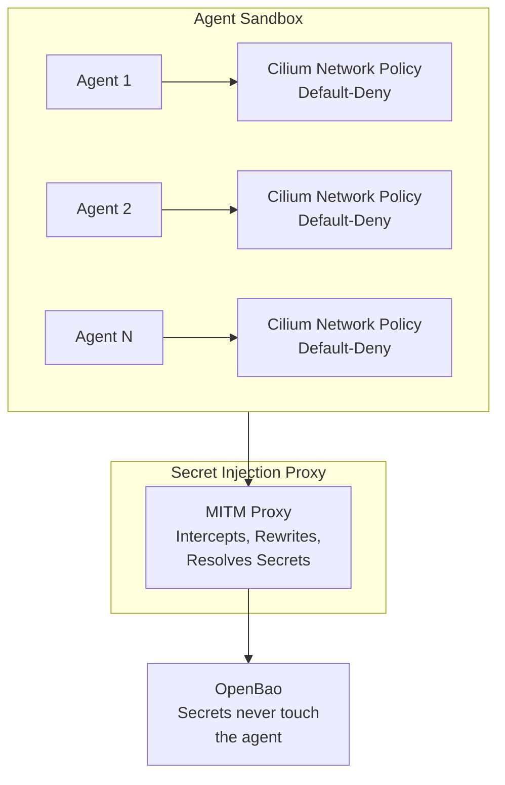

ClawArmor is a platform for running AI agents. It provides strong isolation
guarantees, zero-trust secret management, default-deny network posture and
control over the software packages your agents have access to.

## Core Ideas

1. **Default-Deny Networking**: Agents can only reach destinations explicitly
   configured in their Environment. All other network traffic is blocked by
   Cilium network policies.
2. **Zero-Trust Secrets**: Agent containers never receive secrets directly.
   Instead, a sidecar proxy intercepts outbound requests and substitutes
   secret references with actual values fetched from OpenBao.
3. **Control what your agents can run**: Define which tools and packages your
   agents can use in one place. Reuse that definition across multiple agents.
   Update it once, all agents automatically get the change.

## Platform Components

| Component | Purpose                                                                             |
|-----------|-------------------------------------------------------------------------------------|
| Manager   | Kubernetes operator that reconciles Agent and Environment custom resources          |
| Gateway   | HTTP API for managing agents, secrets and environments, querying observability data |
| Sinjector | Sidecar proxy that performs secret injection via MITM                               |
| Observer  | Collects telemetry from KubeArmor, Hubble, and OTLP sources                         |

## Read Further

- [Agent Sandbox](./docs/agent-sandbox.md)
- [Secret Injection](./docs/secret-injection.md)
- [Environments](./docs/environments.md)
- [OpenCode Interoperability](./docs/opencode.md)
