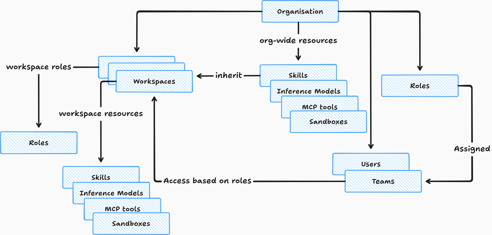
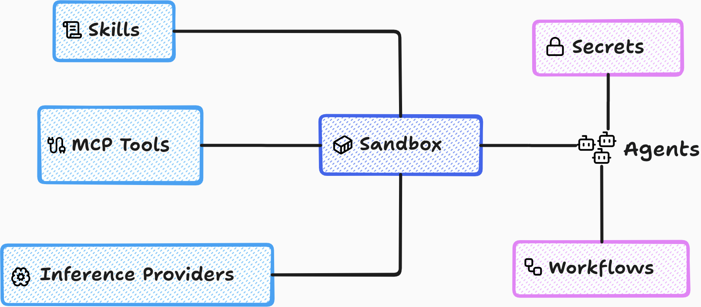
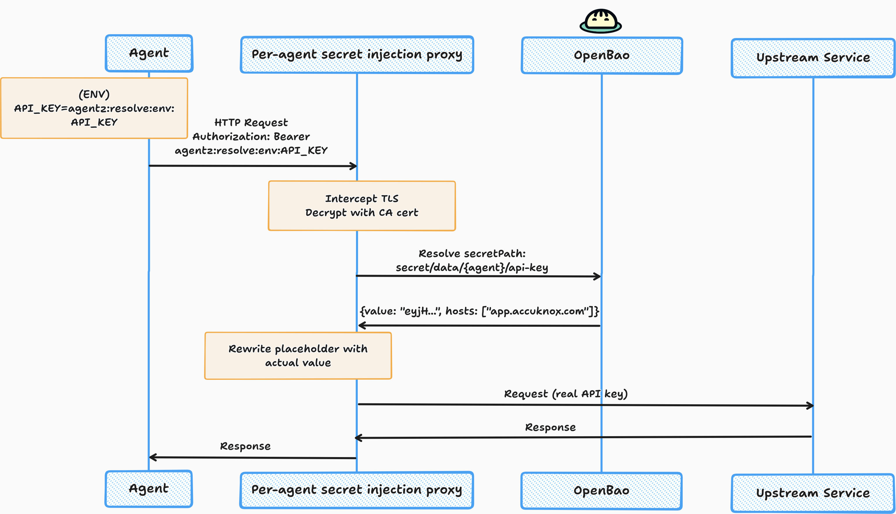

<div align="center">
    
    <h1>AgentZ</h1>
    <h3>Zero Trust Agentic AI Platform</h3>
    <p><b>Build, run, and govern AI agents. Secure by design.</b></p>
    <p>
        Every agent runs inside a default-deny sandbox and never receives a
        credential.<br/>
        Every agent action is traceable.
    </p>
    <a href="https://www.producthunt.com/products/agentz?embed=true&utm_source=badge-featured&utm_medium=badge&utm_campaign=badge-agentz" target="_blank" rel="noopener noreferrer"></a>
</div>

AgentZ is a multi-tenant platform for running AI agents. It provides strong
isolation guarantees, zero credential exposure to agents, default-deny network
posture and control over the software packages your agents have access to.



## Building Blocks



1. **Inference Providers**: We support a range of providers (derived from
   [OpenCode](https://opencode.ai/)), including Amazon Bedrock, GCP Vertex,
   Azure AI Foundry, OpenAI Codex subscription. We also support configuring
   custom OpenAI/Anthropic endpoints.

2. **Skills**: There are two kinds of skills - mutable and immutable. Mutable
   skills are those that can be modified by the agents, and in fact, are often
   produced by the agents themselves. Immutable skills are user uploaded and
   supporting versioning and rollbacks.

3. **MCP tools**: Similar to inference providers, we also provide a catalog
   for MCP servers. If there's a provider we do not support, you can add a
   custom server.

4. **Sandbox**: A set of reusable configuration (models, skills, mcp tools,
   software packages and allowed hosts). Agents inherit all the properties of
   their sandbox. An agent's sandbox can be swapped / re-configured anytime,
   resulting in its properties to also change.

5. **Agents**: An agent is a Kubernetes Pod that runs an OpenCode server with
   custom plugins and tools under the hood. AgentZ uses Cilium network policies
   to implement a default-deny posture. An agent pod cannot send traffic to any
   destination unless an explicit rule permits it.

   Agents are stateful, and must be treated as such. Their home directory is
   backed by a Kubernetes PVC i.e. it persists across restarts.

6. **Secrets**: MCP is not without its problems. Often, using a CLI tool is
   simpler and more effective. CLI tools that connect to external services,
   such as Gmail and Google Calendar, require authentication tokens or API keys.
   This is where the secret injection proxy comes into play.

   When you create a secret in AgentZ, instead of injecting the actual
   credential, we inject a placeholder, such as `agentz:resolve:env:API_KEY`.
   When your agents call Gmail APIs, the injection proxy replaces the
   placeholder with the actual credential. Your agents never get direct access
   to the credential.

   Furthermore, when creating a secret, you must explicitly provide a set of
   hosts for which the secret is valid. This helps prevent secret
   exfiltration.



## Workflows

- You can ask your agents to develop workflows for repeated tasks
- Workflows can run on a schedule or can be invoked through a webhook. Check [#40](https://github.com/accuknox/agentZ/pull/40)).
- Workflow supports typed fields and arbitrary JSON (check [#48](https://github.com/accuknox/agentZ/pull/48)) as inputs.

## OpenCode Interoperability

There are dozens of AI agents out there. We did not want to reinvent our own.
We believe meta-harness is the right way to go.

The Gateway's OpenCode API is interoperable with the OpenCode TUI client. You
can connect to the agent using:

```
opencode attach https://agentzharness.ai/api/opencode/{AGENT_NAME}/
```

## Open-Source Projects

This project wouldn't have been possible without the many excellent open-source libraries and projects it builds on.

- [OpenCode](http://opencode.ai/)
- [AgentGateway](https://agentgateway.dev/)
- [OpenBao](https://openbao.org/)
- [Cilium](https://cilium.io/)
- [KubeArmor](https://kubearmor.io/)
- [Better Auth](https://better-auth.com/)
