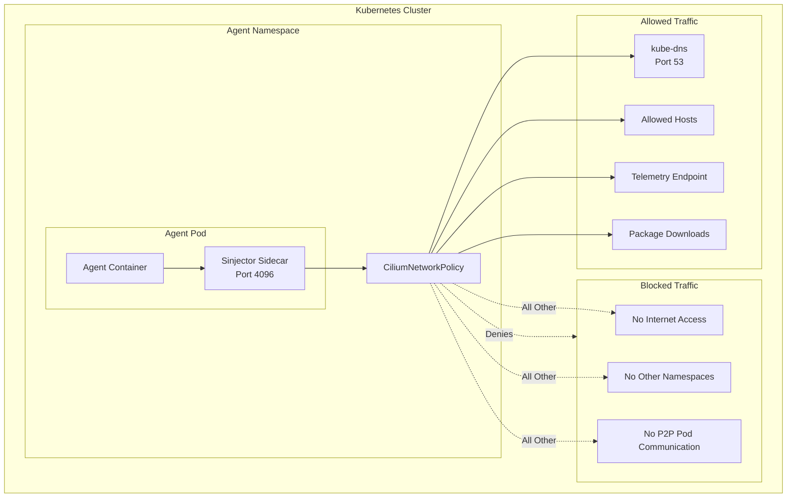

# Agent Sandbox

Every ClawArmor agent runs inside a security sandbox that enforces strict
boundaries around network access, OS-level (process, file and network)
visibility, and compute resources.

ClawArmor uses Cilium network policies to implement a default-deny posture. An
agent pod cannot send traffic to any destination unless an explicit rule
permits it.

When an agent is created, the ClawArmor controller generates a Cilium network
policy that controls all outbound traffic. The policy permits:

1. **DNS Resolution** - Outbound traffic to the cluster's DNS service on port
   53. This allows the agent to resolve host names for permitted destinations.
2. **Allowed Hosts** - Outbound traffic to hosts explicitly listed in the
   Environment's `allowedHosts` field. This includes:
   - Exact domains (e.g., `api.github.com`)
   - Wildcard patterns (e.g., `*.github.com`)
   - CIDR ranges (e.g., `10.0.0.0/24`, `2001:db8::/32`)
3. **Telemetry Endpoint** - If observability is enabled, the agent can reach
   the configured OTLP trace endpoint.
4. **Secret Injection Proxy** - If secret injection is enabled, the agent can
   communicate with the sidecar proxy on port 4096.

All other egress traffic is denied by the Cilium enforcement layer.
