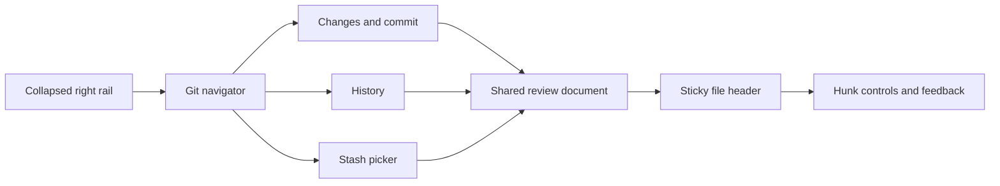

# Zed Git workflows and the AgentZ redesign

Research date: 2026-09-11.

Reference checkout: `.ref/zed`, cloned from
[`zed-industries/zed`](https://github.com/zed-industries/zed) with complete
working-tree contents and shallow history. The inspected revision is
[`3cef31688ae2df816c9ce04fc254c172764485e8`](https://github.com/zed-industries/zed/commit/3cef31688ae2df816c9ce04fc254c172764485e8).
The clone occupies approximately 119 MiB and remains ignored by AgentZ Git.
AgentZ was inspected at
[`0298da91dad8d7a4f9d93f42e13880ea0ca12b33`](https://github.com/accuknox/agentZ/commit/0298da91dad8d7a4f9d93f42e13880ea0ca12b33),
on `feat/coding-workspace`.

This is a source investigation and implementation specification. No application
code changed during this research. Zed's native application and its Rust tests
were **not** run. Evidence consists of the pinned source and tests, first-party
documentation and screenshots, our source, and disposable Git command
experiments. A test found in source is not presented as an executed test.
Recommendations below are AgentZ design decisions, not claims about Zed.

Read the [proposed interaction design](#proposed-agentz-interaction-design)
and [implementation boundaries](#implementation-boundaries-and-cleanup) for the
redesign specification. The detailed source audit covers the
[Git panel](#zed-the-compact-git-panel), [diff and review](#zed-diff-and-review),
and [stashes](#zed-stashes-and-repository-operations). The
[delivery gates](#delivery-order-and-completion-gates) and
[manual acceptance matrix](#manual-acceptance-matrix-for-implementation) define
what completion should require.

## The decision

Rebuild the Git workflow around a compact navigator and a dedicated review
surface. Keep our collapsed right icon rail. Opening Git should expose the
repository state, changed files, staging controls, and commit composer. Reviewing
changes should give code most of the available workspace, with one continuous
review list and a clear comparison target.

Our recent tab, font, and spacing fixes are useful, but they do not supply the
missing workflow. The largest gaps are the absence of hunk staging, stash APIs,
conflict states, repository-wide review, and explicit snapshot identity. Zed's
strength comes from keeping these concepts separate while letting the user move
between them without losing their place. The evidence and exceptions are
recorded below.

Preserve these AgentZ decisions:

- The collapsed right icon rail is the starting point. Review is entered on
  demand; it does not replace the rail or force a permanent extra column.
- Use the existing shadcn components, Lucide icons, semantic color tokens, and
  the shared monospace font token. Do not import Zed's theme or draw another
  icon set.
- Keep generated Go/TypeScript contracts authoritative. Change
  `openapi/base.yaml`, then run the existing generators. `openapi/gateway.yaml`
  is itself generated; it is not the editing target.
- Keep repository credentials in the trusted web worker. Local diffs, staging,
  stashes, and conflict inspection belong to the sandbox Git service.
- Retain reviewed-tree validation for commits, remote ancestry checks, and the
  exact remote lease used for pushes.

These constraints follow our current
[font integration](../../web/app/globals.css),
[UI composition](../../web/components/blocks/coding/workspace.tsx),
[generator pipeline](../../Makefile),
[OpenAPI generator inputs](../../hack/openapi/generate_opencode_gateway.go),
and [trusted Git worker](../../web/lib/coding/git.ts).

## Evidence and visual reference

Source outranks documentation when they disagree. Zed's current defaults and
implementation differ from portions of its Git documentation. The detailed
findings below identify those discrepancies rather than combining different
versions into an imaginary product.

Two first-party visuals were inspected:

- [Split diff review screenshot](https://zed.dev/img/post/split-diffs/multibuffer.webp),
  published with [Split Diffs are Here](https://zed.dev/blog/split-diffs),
  February 18, 2026. The meaningful layout is a wide review surface, one action
  bar, file headers, aligned old/new content, and actions close to the hunk.
- [Agent/editor/panel layout screenshot](https://images.zed.dev/blog/parallel-agents/layout.webp),
  published with [Introducing Parallel Agents](https://zed.dev/blog/parallel-agents),
  April 22, 2026. It shows the division between thread navigation, conversation,
  editor, and secondary panels. It is a layout reference, not proof of current
  Git controls.

The screenshots predate the pinned source. They support visual observations,
not assertions about current defaults, action availability, or measured speed.

## AgentZ: current implementation and concrete gaps

The current Git implementation is concentrated in
[`CodingWorkspace`](../../web/components/blocks/coding/workspace.tsx),
[`filesystem/git.go`](../../internal/gateway/filesystem/git.go),
[`coding/actions.ts`](../../web/lib/coding/actions.ts), and
[`coding/git.ts`](../../web/lib/coding/git.ts).
The original contract is in
[`openapi/base.yaml`, CodingGitRequest/Result/File](../../openapi/base.yaml#L9558).

| Area | What AgentZ actually does | Consequence |
| --- | --- | --- |
| Layout | A 480px default panel contains file search, two status groups, comparison tabs, one file's diff, and a conditional commit form. Expansion makes the same panel wider. | Code competes with navigation and forms; expansion does not create a continuous repository review workflow. |
| Comparison | `staged` is a boolean selecting `diff` or `staged_diff`. | There is no explicit HEAD-to-worktree All changes mode, branch comparison, commit review, or stash comparison. |
| Navigation | The selected path falls back to the first parsed file. Previous/next advances files, not hunks. | Refreshes and removals can change the visible file without a deliberate next-review-target rule. |
| File identity | Status supplies literal paths; parsed patch headers supply display names. A separate `escapedDiffs` list compensates for mismatches. | A newline in a filename creates different identities in status and the renderer. Review actions must not infer their target from display text. |
| Staging | `git add -- <paths>` or `git reset HEAD -- <paths>`. | Whole-file only. No hunk/selected-hunk actions, partial-state control, or stage-and-next flow. |
| New files | `git diff` does not include untracked content. The UI asks the user to stage it or open the file elsewhere. | The user must mutate staging state or leave review to inspect a new file. |
| Conflict state | Every successful status response requires `git write-tree`. | An unmerged index prevents status from returning, precisely when a conflict list is needed. |
| Status cost | Status runs both complete patches, branch listing, and `write-tree`; the panel polls every five seconds while any tool is open. | A routine refresh pays for full diff generation and parsing, including while the user is in Terminal or Session context. |
| Concurrency | The gateway locks the project; the filesystem service locks its shared service mutex. Mutations compare expected HEAD. | Other API operations serialize, but terminal/agent edits do not participate in those application locks. HEAD can stay unchanged while the reviewed content or index changes. |
| Payload | Git stdout is limited to 64 MiB per command; request paths have a declared maximum of 1,000. | Large changes can fail the entire request. Bulk operations need an explicit contract rather than assuming every path fits one request. |
| Commit | Export a staged-tree transport commit; construct the real commit in a trusted bare repository; validate parent/tree before applying it. | This is valuable correctness work to preserve. The UI still needs explicit message generation, pending state, and recovery without losing the draft. |
| Remote | GitHub metadata/actions live in a separate tab; pull is fast-forward only; push checks ancestry and the exact observed remote head. | Remote state is split from local Git context, but its credential and concurrency boundary should survive the redesign. |
| Stash | There is no stash operation in the source contract or current panel. | A styled stash picker alone cannot work. Listing, preview, creation, restore, and deletion need real local Git APIs. |
| Review persistence | No independent reviewed-file state, content-bound review comments, or review-session model. | Staged cannot safely double as reviewed, especially while an agent is still editing. |
| Special files | Zero-hunk patches produce rename or metadata/binary placeholders. | This existing behavior should remain; it needs structured binary/mode/rename metadata and should not be replaced by an empty editor. |

Source locations at the inspected AgentZ revision:

- [UI state, queries, projections, and mutation behavior](https://github.com/accuknox/agentZ/blob/0298da91dad8d7a4f9d93f42e13880ea0ca12b33/web/components/blocks/coding/workspace.tsx#L132-L250).
- [Changed-file list and one-file diff rendering](https://github.com/accuknox/agentZ/blob/0298da91dad8d7a4f9d93f42e13880ea0ca12b33/web/components/blocks/coding/workspace.tsx#L363-L663).
- [Filesystem locking and command limits](https://github.com/accuknox/agentZ/blob/0298da91dad8d7a4f9d93f42e13880ea0ca12b33/internal/gateway/filesystem/git.go#L28-L122).
- [HEAD guard and whole-file mutations](https://github.com/accuknox/agentZ/blob/0298da91dad8d7a4f9d93f42e13880ea0ca12b33/internal/gateway/filesystem/git.go#L190-L217).
- [Status, complete patches, and mandatory write-tree](https://github.com/accuknox/agentZ/blob/0298da91dad8d7a4f9d93f42e13880ea0ca12b33/internal/gateway/filesystem/git.go#L314-L369).
- [Commit, pull, and push correctness checks](https://github.com/accuknox/agentZ/blob/0298da91dad8d7a4f9d93f42e13880ea0ca12b33/web/lib/coding/actions.ts#L150-L233).
- [Project access and locking](https://github.com/accuknox/agentZ/blob/0298da91dad8d7a4f9d93f42e13880ea0ca12b33/internal/gateway/coding.go#L613-L670).

### Disposable command checks

These experiments ran with Git 2.47.3 in temporary repositories, then removed
them. They did not alter the user's project, sandbox checkout, or remote refs.
They establish the behavior of commands our implementation uses. They are not
claims that Zed's native UI was exercised.

| Experiment | Observed result | Meaning for AgentZ |
| --- | --- | --- |
| Add an untracked `new.txt`, then run ordinary `git diff`. | Status is `?? new.txt`; patch is empty. | A review read path must explicitly load untracked contents. Staging should not be a prerequisite. |
| Create overlapping commits and merge to an unresolved conflict. | Status is `UU tracked.txt`; `git write-tree` exits 128. | Our unconditional `write-tree` makes the whole status request fail. Conflict status must remain readable without a writable tree. |
| Read a diff, edit the file again without committing, then stage it. | HEAD is unchanged, but the index contains the later edit. | Expected HEAD is not a reviewed-content guard. Hunk actions require index/content identity. |
| Parse a binary patch through installed `@pierre/diffs`. | File metadata survives with zero hunks. | Keep an explicit binary/metadata presentation. |
| Parse a pure rename patch. | `type=rename-pure`, previous/new names, zero hunks. | Preserve rename metadata; do not invent line changes. |
| Stage a file named `space and\nnewline.txt`, then compare status to parsed patch. | Porcelain contains a literal newline; renderer metadata retains the escaped `\\n` sequence. | Keep the literal server path as identity independently of the renderer's parsed filename. |

The conflict check is reproducible with a one-line file changed differently on
two branches, followed by `git merge <other-branch>`, `git status --porcelain`,
and `git write-tree`. The stale-stage check needs only a tracked file: capture
HEAD and a diff, edit the file again, confirm HEAD is unchanged, then run
`git add -- <file>` and `git show :<file>`.

The existing tests cover a useful worktree/transport lifecycle and path
containment, plus trusted commit identity and GitHub credential behavior. They
do not establish conflict review, stash workflows, or partial staging parity.
See [filesystem tests](../../internal/gateway/filesystem/git_test.go),
[trusted Git tests](../../web/lib/coding/git.test.ts), and
[GitHub tests](../../web/lib/coding/github.test.ts).

## Zed: the compact Git panel

### Layout and defaults

The panel is a navigation and operation console. The review itself opens in the editor area. Its normal vertical composition is Changes/History tabs, a compact actions header, a flexible scrolling changed-file list, repository/branch/remote controls, a commit editor with its actions, and a last-commit row. The code does not place a full diff below the changed-file list inside this narrow panel. `render` fixes the overall container to available size and clips overflow, while the file list owns its scroll area. [git_panel.rs:8929-9063](https://github.com/zed-industries/zed/blob/3cef31688ae2df816c9ce04fc254c172764485e8/crates/git_ui/src/git_panel.rs#L8929-L9063)

Actual defaults are right dock, 360px width, closed on startup, status icons, file icons off, flat list, path sorting, Tracked/Untracked grouping, diff statistics on, and icon count badge off. The click default is `project_diff`. Settings expose those choices, section grouping, title-length warning, folder indicators, scrollbar visibility, and untracked-diff collapse. [default.json:1060-1135](https://github.com/zed-industries/zed/blob/3cef31688ae2df816c9ce04fc254c172764485e8/assets/settings/default.json#L1060-L1135), [git_panel_settings.rs:17-35](https://github.com/zed-industries/zed/blob/3cef31688ae2df816c9ce04fc254c172764485e8/crates/git_ui/src/git_panel_settings.rs#L17-L35)

The dock accepts only left or right. Setting its position writes the user's settings file. The GitBranch status icon can be hidden; its optional badge counts changed paths and disappears at zero. [git_panel.rs:9112-9162](https://github.com/zed-industries/zed/blob/3cef31688ae2df816c9ce04fc254c172764485e8/crates/git_ui/src/git_panel.rs#L9112-L9162)

**Documentation discrepancy:** `docs/src/git.md` says the panel defaults left and can move to the bottom. Both conflict with the executable configuration and docking predicate above. Treat the source as authoritative for this pinned revision. [git.md:39-41](https://github.com/zed-industries/zed/blob/3cef31688ae2df816c9ce04fc254c172764485e8/docs/src/git.md#L39-L41)

The top tabs fill the available width equally. Inactive tabs use editor background at 60% opacity and muted text. Changes carries the changed-path count. Both use the application's existing tab height rather than a separately invented Git header height. The Changes actions row offers View Diff with total additions/deletions, a View Options popover, and a Stage All/Unstage All split button. The row can wrap at narrow widths. [git_panel.rs:6875-6944](https://github.com/zed-industries/zed/blob/3cef31688ae2df816c9ce04fc254c172764485e8/crates/git_ui/src/git_panel.rs#L6875-L6944), [git_panel.rs:6357-6458](https://github.com/zed-industries/zed/blob/3cef31688ae2df816c9ce04fc254c172764485e8/crates/git_ui/src/git_panel.rs#L6357-L6458)

### File rows and visual hierarchy

The changed-file list uses `uniform_list` virtualization. It renders only requested ranges, retains its scroll handle, estimates the widest item, and uses shared scrollbars. Tree view decorates that same list with panel indent guides. Each file and group header is 1.75rem high. File names use normal single-line labels; paths are secondary muted text. Optional per-file addition/deletion counts sit before a trailing staging checkbox. The staging checkbox is a real shared Checkbox component with checked, unchecked, and indeterminate states. [git_panel.rs:7735-7887](https://github.com/zed-industries/zed/blob/3cef31688ae2df816c9ce04fc254c172764485e8/crates/git_ui/src/git_panel.rs#L7735-L7887), [git_panel.rs:8315-8411](https://github.com/zed-industries/zed/blob/3cef31688ae2df816c9ce04fc254c172764485e8/crates/git_ui/src/git_panel.rs#L8315-L8411)

Default status presentation uses Git status icons, not full-row color. The alternative LabelColor mode uses semantic conflict/added/modified colors. Deleted labels are disabled and struck through because the authors explicitly avoid a list full of red labels. File-type icons are optional, rather than duplicated by default alongside status icons. Selected rows use the theme's information color at 8% alpha; marked rows use 12%; a row that is both selected and marked uses 20%. Focus receives a separate panel-focused border. These distinguish current navigation from the operation selection without additional columns. [git_panel.rs:8181-8328](https://github.com/zed-industries/zed/blob/3cef31688ae2df816c9ce04fc254c172764485e8/crates/git_ui/src/git_panel.rs#L8181-L8328)

Section headers have a small disclosure chevron, muted small label, and trailing section staging control. The entire header toggles collapse, while the checkbox stops propagation. Empty Staged and Unstaged sections use a single row of placeholder text. No large illustrated card consumes file-list space. [git_panel.rs:7879-8005](https://github.com/zed-industries/zed/blob/3cef31688ae2df816c9ce04fc254c172764485e8/crates/git_ui/src/git_panel.rs#L7879-L8005)

### Grouping, partial staging, and refresh

View Options stays open while changing options. It contains List/Tree, Path/Name sorting for the flat list, and None/Tracked & Untracked/Staged & Unstaged grouping. Changes persist through settings updates. Tree view removes irrelevant sort choices. [git_panel.rs:367-505](https://github.com/zed-industries/zed/blob/3cef31688ae2df816c9ce04fc254c172764485e8/crates/git_ui/src/git_panel.rs#L367-L505), [git_panel.rs:4842-4978](https://github.com/zed-industries/zed/blob/3cef31688ae2df816c9ce04fc254c172764485e8/crates/git_ui/src/git_panel.rs#L4842-L4978)

Staging grouping projects a partially staged path into both sections. Each projection carries the correct staged or unstaged diff statistics. Its action comes from section identity: a Staged row always means Unstage, an Unstaged row always means Stage. Other groupings toggle from the actual file state; partial stage toggles toward fully staged. This distinction prevents a checkbox from acting on the wrong half of a partially staged file. [git_panel.rs:605-659](https://github.com/zed-industries/zed/blob/3cef31688ae2df816c9ce04fc254c172764485e8/crates/git_ui/src/git_panel.rs#L605-L659), [git_panel.rs:5310-5355](https://github.com/zed-industries/zed/blob/3cef31688ae2df816c9ce04fc254c172764485e8/crates/git_ui/src/git_panel.rs#L5310-L5355)

The order in staging mode is Conflicts, Staged, Unstaged. Conflicts stay out of ordinary Staged/Unstaged section bulk operations. During a merge, a file that was conflicted remains in Conflicts after it is marked resolved. Its row checkbox and ordinary toggle shortcut become disabled, and the all-resolved conflict header checkbox becomes disabled. **Scope matters:** this protection is specific to these row, section, and range paths. Global Stage All/Unstage All delegates to repository operations that do not exclude conflicts in the inspected implementation. Do not claim Zed universally protects conflicts from every staging command. [git_panel.rs:669-690](https://github.com/zed-industries/zed/blob/3cef31688ae2df816c9ce04fc254c172764485e8/crates/git_ui/src/git_panel.rs#L669-L690), [git_panel.rs:3370-3400](https://github.com/zed-industries/zed/blob/3cef31688ae2df816c9ce04fc254c172764485e8/crates/git_ui/src/git_panel.rs#L3370-L3400), [git_panel.rs:5439-5466](https://github.com/zed-industries/zed/blob/3cef31688ae2df816c9ce04fc254c172764485e8/crates/git_ui/src/git_panel.rs#L5439-L5466), [git_store.rs:8122-8189](https://github.com/zed-industries/zed/blob/3cef31688ae2df816c9ce04fc254c172764485e8/crates/project/src/git_store.rs#L8122-L8189)

Path sort compares complete paths. Name sort compares basenames then paths. Tree mode sorts by paths, emits directories before files, compacts single-child directory chains, and starts directories expanded. Expansion keys include section and path, so expanding `src` under Staged does not alter `src` under Unstaged. Hidden descendants remain in the logical model for directory operations. [git_panel.rs:854-979](https://github.com/zed-industries/zed/blob/3cef31688ae2df816c9ce04fc254c172764485e8/crates/git_ui/src/git_panel.rs#L854-L979), [git_panel.rs:5390-5410](https://github.com/zed-industries/zed/blob/3cef31688ae2df816c9ce04fc254c172764485e8/crates/git_ui/src/git_panel.rs#L5390-L5410)

Refresh captures selected path and section before rebuilding. It restores that same projection when present, otherwise selects the remaining projection for that path. Removed file/directory marks are pruned, and stale shift-range anchors are cleared. Repository changes clear marks. A 50ms debounce groups updates. Staging presentation first consults nonfailed pending operations, then current repository status, then the row snapshot. The code explains that this precedence prevents transient checkbox flicker during refresh. [git_panel.rs:5218-5240](https://github.com/zed-industries/zed/blob/3cef31688ae2df816c9ce04fc254c172764485e8/crates/git_ui/src/git_panel.rs#L5218-L5240), [git_panel.rs:5570-5612](https://github.com/zed-industries/zed/blob/3cef31688ae2df816c9ce04fc254c172764485e8/crates/git_ui/src/git_panel.rs#L5570-L5612), [git_panel.rs:3026-3055](https://github.com/zed-industries/zed/blob/3cef31688ae2df816c9ce04fc254c172764485e8/crates/git_ui/src/git_panel.rs#L3026-L3055), [git_panel.rs:5069-5106](https://github.com/zed-industries/zed/blob/3cef31688ae2df816c9ce04fc254c172764485e8/crates/git_ui/src/git_panel.rs#L5069-L5106)

### Selection, keyboard, and contextual commands

Staging and selection are separate concepts. Plain click clears marks, selects one row, and opens its configured review target. Secondary-modifier click toggles a mark and promotes the previous selection into the marked set. Shift-click extends a range. Shift-arrow ranges can shrink when reversed while preserving marks that existed before the gesture. Directory marks include their descendants; headers and empty rows are not selectable. Escape clears marks first, then returns focus out of the panel. [git_panel.rs:1493-1654](https://github.com/zed-industries/zed/blob/3cef31688ae2df816c9ce04fc254c172764485e8/crates/git_ui/src/git_panel.rs#L1493-L1654), [git_panel.rs:8412-8440](https://github.com/zed-industries/zed/blob/3cef31688ae2df816c9ce04fc254c172764485e8/crates/git_ui/src/git_panel.rs#L8412-L8440)

The operation target is the marked set when a multiselection exists, otherwise the selected row. A lone mark on another row does not hijack the current selected-row operation. Bulk toggle stages if any affected file is not fully staged; otherwise it unstages. Requests deduplicate paths, which matters when the same partial file appears twice. [git_panel.rs:1603-1625](https://github.com/zed-industries/zed/blob/3cef31688ae2df816c9ce04fc254c172764485e8/crates/git_ui/src/git_panel.rs#L1603-L1625), [git_panel.rs:3370-3435](https://github.com/zed-industries/zed/blob/3cef31688ae2df816c9ce04fc254c172764485e8/crates/git_ui/src/git_panel.rs#L3370-L3435), [git_panel.rs:3204-3245](https://github.com/zed-industries/zed/blob/3cef31688ae2df816c9ce04fc254c172764485e8/crates/git_ui/src/git_panel.rs#L3204-L3245)

Right-click inside the marked set keeps that set; right-click outside clears it. Menu labels say Stage/Unstage N Files, Trash N Files, or Discard Changes to N Files. Single-row menus also expose staged/unstaged review, copy absolute/relative path, ignore/exclude, project diff, file diff, source file, and file history. Ignore/exclude is disabled for tracked files and multiselection. [git_panel.rs:8021-8104](https://github.com/zed-industries/zed/blob/3cef31688ae2df816c9ce04fc254c172764485e8/crates/git_ui/src/git_panel.rs#L8021-L8104)

Default click opens project diff and returns focus to the list so arrows can continue review. Double-click opens file diff. Configurable FileDiff and ViewFile defaults have their own secondary action, which returns to project diff. [git_panel.rs:2483-2511](https://github.com/zed-industries/zed/blob/3cef31688ae2df816c9ce04fc254c172764485e8/crates/git_ui/src/git_panel.rs#L2483-L2511)

Linux defaults include Ctrl-Shift-G for panel focus, Ctrl-1/2 for Changes/History, Up/Down navigation, Left/Right tree collapse/expand, Space stage toggle, Shift-Space range stage, Tab and Shift-Tab between list and commit editor, Enter review, Alt-Enter alternate review, Delete discard with confirmation, Ctrl-Space stage all, Ctrl-Shift-Space unstage all, Ctrl-Enter commit, Ctrl-Shift-Enter amend, Alt-L generate commit message. Contexts explicitly prevent list shortcuts consuming branch/repository picker input. Tooltips frequently include both the keybinding and underlying Git command. These are observed keyboard conventions, not a completed screen-reader accessibility audit. [default-linux.json:1024-1130](https://github.com/zed-industries/zed/blob/3cef31688ae2df816c9ce04fc254c172764485e8/assets/keymaps/default-linux.json#L1024-L1130)

### Commit composer and persistent state

The footer composer exists whenever there is an active repository, including no-change states. It uses the regular editor backed by a commit-message buffer, with six lines in-panel and eighteen in the modal. Gutter, indent guides, wrap guides, and autoclose are disabled. Its family, fallbacks, features, weight, and line height come from the shared buffer-font settings. The font size is the existing Git commit buffer font-size setting. There is no standalone Git font family. [git_panel.rs:1195-1228](https://github.com/zed-industries/zed/blob/3cef31688ae2df816c9ce04fc254c172764485e8/crates/git_ui/src/git_panel.rs#L1195-L1228), [git_panel.rs:9175-9200](https://github.com/zed-industries/zed/blob/3cef31688ae2df816c9ce04fc254c172764485e8/crates/git_ui/src/git_panel.rs#L9175-L9200)

Two small controls expand the editor within the panel or open a commit modal. Panel expansion hides tabs and the changed-file list. The composer has a subtly different editor background. If configured, an overlong title gets a warning strip and warning border; the default limit is zero, so this warning is off by default. Generation becomes a red Stop control and Generating Commit label during work. Missing model configuration disables generation and provides a configuration tooltip. The commit button is a compact split button rather than a large full-width CTA. [git_panel.rs:6272-6311](https://github.com/zed-industries/zed/blob/3cef31688ae2df816c9ce04fc254c172764485e8/crates/git_ui/src/git_panel.rs#L6272-L6311), [git_panel.rs:6485-6740](https://github.com/zed-industries/zed/blob/3cef31688ae2df816c9ce04fc254c172764485e8/crates/git_ui/src/git_panel.rs#L6485-L6740), [git_panel.rs:6041-6118](https://github.com/zed-industries/zed/blob/3cef31688ae2df816c9ce04fc254c172764485e8/crates/git_ui/src/git_panel.rs#L6041-L6118)

The primary label explains scope. It is Commit when anything is staged, otherwise Commit Tracked. The latter automatically stages tracked changed paths, excluding newly created files, then commits. Amend has analogous Amend/Amend Tracked labels. Hovering Commit Tracked previews selected staging checkboxes for tracked paths. A commit is disabled during generation or pending commit, without a message, without applicable changes, with unresolved conflicts, or without write access; tooltips explain which condition applies. The menu includes Amend, Signoff, and Skip Hooks. Successful commit clears skip-hooks and message/amend state; failure preserves the draft and reports an error. [git_panel.rs:6238-6270](https://github.com/zed-industries/zed/blob/3cef31688ae2df816c9ce04fc254c172764485e8/crates/git_ui/src/git_panel.rs#L6238-L6270), [git_panel.rs:3630-3730](https://github.com/zed-industries/zed/blob/3cef31688ae2df816c9ce04fc254c172764485e8/crates/git_ui/src/git_panel.rs#L3630-L3730), [git_panel.rs:6160-6231](https://github.com/zed-industries/zed/blob/3cef31688ae2df816c9ce04fc254c172764485e8/crates/git_ui/src/git_panel.rs#L6160-L6231)

Serialization stores signoff and per-repository commit messages keyed by work-directory absolute path, including pre-amend text and pending amend for the active repository. It is throttled and workspace/session scoped. Switching repositories clears marks and skip-hooks and exits amend, restoring the original draft before changing buffers. The serialized panel object does not include active tab, marked rows, or collapsed sections; do not assume those survive application restart just because settings do. [git_panel.rs:542-557](https://github.com/zed-industries/zed/blob/3cef31688ae2df816c9ce04fc254c172764485e8/crates/git_ui/src/git_panel.rs#L542-L557), [git_panel.rs:1738-1816](https://github.com/zed-industries/zed/blob/3cef31688ae2df816c9ce04fc254c172764485e8/crates/git_ui/src/git_panel.rs#L1738-L1816), [git_panel.rs:5069-5096](https://github.com/zed-industries/zed/blob/3cef31688ae2df816c9ce04fc254c172764485e8/crates/git_ui/src/git_panel.rs#L5069-L5096)

The last-commit strip opens its diff, provides Uncommit and graph shortcuts, and offers a richer hover tooltip. Uncommit checks whether the commit was pushed and asks before rewriting published history. Actual implementation uses soft reset and restores the commit message into the composer. Its displayed command tooltip conditionally omits `--soft`, a source inconsistency worth avoiding. [git_panel.rs:6770-6873](https://github.com/zed-industries/zed/blob/3cef31688ae2df816c9ce04fc254c172764485e8/crates/git_ui/src/git_panel.rs#L6770-L6873), [git_panel.rs:3733-3805](https://github.com/zed-industries/zed/blob/3cef31688ae2df816c9ce04fc254c172764485e8/crates/git_ui/src/git_panel.rs#L3733-L3805)

### Repository, branch, and remote controls

Repository context sits immediately above the commit editor. For a single repository the name and separator are omitted, leaving a compact branch selector. Multiple repositories show repository/branch. Detached HEAD shows an eight-character SHA, and an unborn/no-branch state has an explicit fallback. Branch and repository pickers open upward from the footer. [git_panel.rs:9307-9434](https://github.com/zed-industries/zed/blob/3cef31688ae2df816c9ce04fc254c172764485e8/crates/git_ui/src/git_panel.rs#L9307-L9434)

Repository picker is a shared uniform-list Picker with scrollbar, case-insensitive substring search, case-insensitive alphabetical sorting, active repository checkmark, and a status summary icon. Conflict wins summary priority, then deleted, modified, added. Search is at the end of the footer popover, near its trigger. [repository_selector.rs:32-73](https://github.com/zed-industries/zed/blob/3cef31688ae2df816c9ce04fc254c172764485e8/crates/git_ui/src/repository_selector.rs#L32-L73), [repository_selector.rs:178-307](https://github.com/zed-industries/zed/blob/3cef31688ae2df816c9ce04fc254c172764485e8/crates/git_ui/src/repository_selector.rs#L178-L307)

Branch picker uses async fuzzy matching with smart case, offers All/Local/Remote filters, highlights matches, shows commit subject and relative time, distinguishes current/selected branch, and supports branch creation from typed input. Checkout picker collapses tracked remote branches to avoid detaching HEAD; diff-base selection deliberately retains remote refs because they can point to different commits. Empty query prioritizes HEAD and recent commits, with further selection-context priority for diff-base selection. Local/remote grouping preference also affects ordering. Branch-list partial failure appears as a warning banner while usable entries remain. [branch_picker.rs:595-625](https://github.com/zed-industries/zed/blob/3cef31688ae2df816c9ce04fc254c172764485e8/crates/git_ui/src/branch_picker.rs#L595-L625), [branch_picker.rs:902-977](https://github.com/zed-industries/zed/blob/3cef31688ae2df816c9ce04fc254c172764485e8/crates/git_ui/src/branch_picker.rs#L902-L977), [branch_picker.rs:1242-1380](https://github.com/zed-industries/zed/blob/3cef31688ae2df816c9ce04fc254c172764485e8/crates/git_ui/src/branch_picker.rs#L1242-L1380), [branch_picker.rs:1399-1533](https://github.com/zed-industries/zed/blob/3cef31688ae2df816c9ce04fc254c172764485e8/crates/git_ui/src/branch_picker.rs#L1399-L1533)

Branch checkout does not blanket-disable dirty worktrees. It delegates `change_branch` and displays a failure prompt if Git refuses. Current branch confirmation just dismisses. New branch secondary confirmation uses the default branch as base. The picker can create remotes through a URL-then-name flow. Noncurrent branches have hover delete, Alt-modified force delete, and a force-delete confirmation after a not-fully-merged error. That error recognition depends on English substrings and explicitly admits localization limitations. Zed also contains a branch-name normalizer that replaces spaces with hyphens. These are observations, not patterns to copy into AgentZ, whose user explicitly forbids normalizer helpers and type guessing. [branch_picker.rs:1535-1611](https://github.com/zed-industries/zed/blob/3cef31688ae2df816c9ce04fc254c172764485e8/crates/git_ui/src/branch_picker.rs#L1535-L1611), [branch_picker.rs:805-838](https://github.com/zed-industries/zed/blob/3cef31688ae2df816c9ce04fc254c172764485e8/crates/git_ui/src/branch_picker.rs#L805-L838), [branch_picker.rs:1095-1209](https://github.com/zed-industries/zed/blob/3cef31688ae2df816c9ce04fc254c172764485e8/crates/git_ui/src/branch_picker.rs#L1095-L1209)

Remote action is a stateful split button: synchronized tracked branch -> Fetch; only ahead -> Push; behind, even when diverged -> Pull; missing upstream -> Publish; gone upstream -> Republish. Counts use small directional arrows. The menu exposes Fetch/Fetch From/Pull/Pull Rebase/Push/Push To/Force Push. All remote kinds share one pending-operation gate to avoid simultaneous credential prompts and competing ref changes. Progress disables the main action and changes its tooltip. These actions are unavailable for collaboration guests. [git_ui.rs:801-847](https://github.com/zed-industries/zed/blob/3cef31688ae2df816c9ce04fc254c172764485e8/crates/git_ui/src/git_ui.rs#L801-L847), [git_ui.rs:1040-1158](https://github.com/zed-industries/zed/blob/3cef31688ae2df816c9ce04fc254c172764485e8/crates/git_ui/src/git_ui.rs#L1040-L1158), [git_panel.rs:4689-4710](https://github.com/zed-industries/zed/blob/3cef31688ae2df816c9ce04fc254c172764485e8/crates/git_ui/src/git_panel.rs#L4689-L4710)

Successful remote commands report a status toast with a PR link or Create Pull Request action after push, or View Log for output worth inspecting. Underlying command output stays available rather than being replaced by a generic success banner. [git_panel.rs:5892-5950](https://github.com/zed-industries/zed/blob/3cef31688ae2df816c9ce04fc254c172764485e8/crates/git_ui/src/git_panel.rs#L5892-L5950)

### History and failure states

History preloads repository graph data and subscribes while active. It handles unborn repositories as empty, detached HEAD through SHA, failed first load as Error, and populated results as Loaded even if a later fetch reports an error. Visible rows load details lazily. Rows show subject/tags, avatar, author, relative time, short SHA, and an unpushed arrow on the first `ahead_count` commits. A current selection gets a keyboard-specific focus border. Clicking opens commit diff. This is a commit-history list, not inline GitHub review comments. [git_panel.rs:566-588](https://github.com/zed-industries/zed/blob/3cef31688ae2df816c9ce04fc254c172764485e8/crates/git_ui/src/git_panel.rs#L566-L588), [git_panel.rs:7104-7194](https://github.com/zed-industries/zed/blob/3cef31688ae2df816c9ce04fc254c172764485e8/crates/git_ui/src/git_panel.rs#L7104-L7194), [git_panel.rs:7208-7493](https://github.com/zed-industries/zed/blob/3cef31688ae2df816c9ce04fc254c172764485e8/crates/git_ui/src/git_panel.rs#L7208-L7493)

History explicitly distinguishes no repository, loading, no commits, and failed load. The failed placeholder does not expose Retry in the inspected renderer. Changes distinguishes no project, uninitialized repository, unsafe ownership, and no changes. Unsafe ownership offers Trust Directory and Learn More; uninitialized offers Initialize Repository; clean branch offers View Branch Diff when the current branch is not literally named main/master. This last branch test is hard-coded rather than based on the configured default branch. Also, a canceled repository-access check is assumed to mean unsafe ownership, which the source itself calls imprecise. These are limitations, not a production-quality checklist to copy verbatim. [git_panel.rs:6946-6975](https://github.com/zed-industries/zed/blob/3cef31688ae2df816c9ce04fc254c172764485e8/crates/git_ui/src/git_panel.rs#L6946-L6975), [git_panel.rs:7537-7678](https://github.com/zed-industries/zed/blob/3cef31688ae2df816c9ce04fc254c172764485e8/crates/git_ui/src/git_panel.rs#L7537-L7678), [git_panel.rs:5260-5287](https://github.com/zed-industries/zed/blob/3cef31688ae2df816c9ce04fc254c172764485e8/crates/git_ui/src/git_panel.rs#L5260-L5287)

### Panel regression tests inspected

These are source tests inspected, not executed:

- Staging grouping verifies duplicate projections for partial paths, separate statistics, section-driven StageIntent, exact section order, and selection staying on a path when its former projection disappears. [git_panel.rs:10618-10890](https://github.com/zed-industries/zed/blob/3cef31688ae2df816c9ce04fc254c172764485e8/crates/git_ui/src/git_panel.rs#L10618-L10890)
- Resolved-conflict test keeps the file under Conflicts during MERGE_HEAD, blocks keyboard toggle, excludes it from the Staged section's Unstage All, and excludes it from a range operation. It does not test global Unstage All. [git_panel.rs:11036-11263](https://github.com/zed-industries/zed/blob/3cef31688ae2df816c9ce04fc254c172764485e8/crates/git_ui/src/git_panel.rs#L11036-L11263)
- Flat range test skips headers in both directions. Shift-range reversal preserves preexisting marks and shrinks to the original anchor. [git_panel.rs:14409-14442](https://github.com/zed-industries/zed/blob/3cef31688ae2df816c9ce04fc254c172764485e8/crates/git_ui/src/git_panel.rs#L14409-L14442), [git_panel.rs:14545-14621](https://github.com/zed-industries/zed/blob/3cef31688ae2df816c9ce04fc254c172764485e8/crates/git_ui/src/git_panel.rs#L14545-L14621)
- Repository-switch test ensures amend and skip-hooks do not leak from A to B and restores A's pre-amend draft. [git_panel.rs:12347-12460](https://github.com/zed-industries/zed/blob/3cef31688ae2df816c9ce04fc254c172764485e8/crates/git_ui/src/git_panel.rs#L12347-L12460)
- Remote serialization test allows Fetch, refuses Push while Fetch is pending, then allows Pull after the pending state clears. [git_panel.rs:12620-12659](https://github.com/zed-industries/zed/blob/3cef31688ae2df816c9ce04fc254c172764485e8/crates/git_ui/src/git_panel.rs#L12620-L12659)
- History tests cover unborn repositories, detached HEAD, and simulated log failure. The failure assertion checks CommitHistory::Error. A no-repository test leaves internal state Loading while the renderer prioritizes the no-repository placeholder. [git_panel.rs:10281-10380](https://github.com/zed-industries/zed/blob/3cef31688ae2df816c9ce04fc254c172764485e8/crates/git_ui/src/git_panel.rs#L10281-L10380)
- Discard prompt test checks a filename with markdown underscores remains a literal code span. [git_panel.rs:10551-10614](https://github.com/zed-industries/zed/blob/3cef31688ae2df816c9ce04fc254c172764485e8/crates/git_ui/src/git_panel.rs#L10551-L10614)

Additional tests located for future implementation acceptance: section-scoped directory expansion at 9735; collapse/reveal navigation at 12772,12897,13036; skip-hooks success/failure at 9917/9954; draft reconnect at 11991; commit-template changes at 12155/12250; marks after refresh at 14833; bulk stage/unstage at 15003; marks on repository switch at 15067. Branch picker tests cover unmerged delete confirmation and cancellation at 2587/2660, explicit force-delete at 2751, filter persistence at 3044, and tracked-remote retention for diff-base selection at 3064.

## Zed: diff and review

### The continuous review document

Zed presents changed files as one navigable, searchable, editable multibuffer document. The Git panel is an index into that document. File selection moves the editor to the corresponding excerpt rather than rebuilding a single-file preview from scratch. Hunk controls belong to the hunks; document controls belong to the toolbar; file controls belong to the sticky file headers. A single-file document is also available, but is a separate navigation choice. [DiffMultibuffer construction](https://github.com/zed-industries/zed/blob/3cef31688ae2df816c9ce04fc254c172764485e8/crates/git_ui/src/diff_multibuffer.rs#L62-L121), [file navigation](https://github.com/zed-industries/zed/blob/3cef31688ae2df816c9ce04fc254c172764485e8/crates/git_ui/src/diff_multibuffer.rs#L207-L280), [sticky file headers](https://github.com/zed-industries/zed/blob/3cef31688ae2df816c9ce04fc254c172764485e8/crates/editor/src/element/header.rs#L617-L807).

This architecture matters when reviewing many files: changing focus in the document synchronizes the panel selection, but only when that editor actually has focus. Background diff refreshes are explicitly forbidden from hijacking the panel selection. The list and document also share ordering rules, including filename sorting with full-path tie breaking, directory-first tree order, and optional conflict/tracked/new grouping. Stable path keys derive from each file's own path/status, never its position in the current list. [Selection synchronization](https://github.com/zed-industries/zed/blob/3cef31688ae2df816c9ce04fc254c172764485e8/crates/git_ui/src/diff_multibuffer.rs#L390-L433), [stable identity and sorting](https://github.com/zed-industries/zed/blob/3cef31688ae2df816c9ce04fc254c172764485e8/crates/git_ui/src/diff_multibuffer.rs#L950-L1038).

### Three working-copy comparisons, with real semantic differences

| View | Comparison | Display buffer | Main actions |
|---|---|---|---|
| Uncommitted Changes / ProjectDiff | HEAD to current working buffer | Live working buffer; editable | Stage, unstage, restore, stage/unstage all, commit |
| Unstaged Changes | Index to current working buffer | Live working buffer; editable | Stage, restore, stage all |
| Staged Changes | HEAD to index | Separate index-text buffer; read-only | Unstage, unstage all, commit |
| Branch Diff | Merge base of selected base ref to current worktree | Live working buffer; editable | Select comparison base; request AI review; no stage/restore hunk chrome |
| Commit / Stash Diff | Historical blobs | Read-only snapshot buffers | Inspect/search/open current file; stash actions when applicable |

`DiffBase` has Head, Index, Staged, and Merge variants. File membership is filtered according to actual index/worktree status. Staged loading returns both its diff and its own index buffer; it does not render the current worktree while merely labeling it staged. [DiffBase](https://github.com/zed-industries/zed/blob/3cef31688ae2df816c9ce04fc254c172764485e8/crates/project/src/git_store/diff_buffer_list.rs#L26-L38), [membership and loading](https://github.com/zed-industries/zed/blob/3cef31688ae2df816c9ce04fc254c172764485e8/crates/project/src/git_store/diff_buffer_list.rs#L294-L458), [ProjectDiff editing](https://github.com/zed-industries/zed/blob/3cef31688ae2df816c9ce04fc254c172764485e8/crates/git_ui/src/project_diff.rs#L220-L260), [StagedDiff read-only setup](https://github.com/zed-industries/zed/blob/3cef31688ae2df816c9ce04fc254c172764485e8/crates/git_ui/src/staged_diff.rs#L178-L222), [UnstagedDiff setup](https://github.com/zed-industries/zed/blob/3cef31688ae2df816c9ce04fc254c172764485e8/crates/git_ui/src/unstaged_diff.rs#L197-L233), [BranchDiff capabilities](https://github.com/zed-industries/zed/blob/3cef31688ae2df816c9ce04fc254c172764485e8/crates/git_ui/src/branch_diff.rs#L314-L356).

The all-uncommitted view keeps staged and unstaged hunks together. A secondary diff classifies each hunk as unstaged, staged, overlapping/partially staged, or staging/unstaging pending. This allows a reviewer to walk the whole logical change without files disappearing merely because staging status changes. The dedicated staged/unstaged views deliberately remove a hunk when it leaves their comparison. These are complementary workflows. [Secondary status model](https://github.com/zed-industries/zed/blob/3cef31688ae2df816c9ce04fc254c172764485e8/crates/buffer_diff/src/buffer_diff.rs#L142-L215), [toolbar capability derivation](https://github.com/zed-industries/zed/blob/3cef31688ae2df816c9ce04fc254c172764485e8/crates/git_ui/src/project_diff.rs#L336-L381).

The comparison views are separately identifiable workspace items. The regression test opens mixed staged/unstaged content, verifies the filtered unstaged view is a different item, returns to the original uncommitted item, then opens a staged item with only the index changes. Staged view serialization restores it as StagedDiff. [Mixed comparison regression](https://github.com/zed-industries/zed/blob/3cef31688ae2df816c9ce04fc254c172764485e8/crates/git_ui/src/project_diff.rs#L1365-L1536), [staged restoration test](https://github.com/zed-industries/zed/blob/3cef31688ae2df816c9ce04fc254c172764485e8/crates/git_ui/src/staged_diff.rs#L945-L1045).

### Unified/split is one implementation with an adaptive preference

Zed uses `SplittableEditor` for its Git review documents. The unified/split choice is persisted as a global editor preference and shared across views. Default settings select split, but automatically render unified below 100 font em-widths. Setting the minimum to zero disables automatic fallback. The threshold is measured using the actual configured code font's advance, not a fixed pixel guess. [Shared controls and persisted preference](https://github.com/zed-industries/zed/blob/3cef31688ae2df816c9ce04fc254c172764485e8/crates/editor/src/split.rs#L414-L532), [default and meaning](https://github.com/zed-industries/zed/blob/3cef31688ae2df816c9ce04fc254c172764485e8/assets/settings/default.json#L405-L416), [width computation](https://github.com/zed-industries/zed/blob/3cef31688ae2df816c9ce04fc254c172764485e8/crates/editor/src/split.rs#L1381-L1408).

The selected Split control stays selected when too narrow, changes its icon, and explains that split will resume when the editor is wide enough. This separates user intent from the currently feasible layout. A modifier click opens the minimum-width setting. The same control is used in SoloDiff's toolbar and the generic multibuffer search/controls toolbar; when search is dismissed, collapse/expand files and diff style controls still render. [Split pending tooltip](https://github.com/zed-industries/zed/blob/3cef31688ae2df816c9ce04fc254c172764485e8/crates/editor/src/split.rs#L447-L530), [controls outside active search](https://github.com/zed-industries/zed/blob/3cef31688ae2df816c9ce04fc254c172764485e8/crates/search/src/buffer_search.rs#L100-L163), [SoloDiff controls](https://github.com/zed-industries/zed/blob/3cef31688ae2df816c9ce04fc254c172764485e8/crates/git_ui/src/solo_diff_view.rs#L601-L646).

The left side is a companion over original content, with deleted-line numbering; it delegates hunk actions to the right editor. There are not two independently mutating implementations. Diff-range translation maps left-side hunks back to source hunks. Both sides share a scroll anchor, synchronize cursor positions, and share wrapping overrides. Toggling back to unified converts the scroll anchor before destroying the companion and restores unified deleted-hunk display. These details are the difference between a usable split view and two adjacent `<pre>` blocks. [Left-side action delegation](https://github.com/zed-industries/zed/blob/3cef31688ae2df816c9ce04fc254c172764485e8/crates/editor/src/split.rs#L730-L750), [source-hunk resolution](https://github.com/zed-industries/zed/blob/3cef31688ae2df816c9ce04fc254c172764485e8/crates/editor/src/git.rs#L257-L330), [scroll/cursor/wrap synchronization](https://github.com/zed-industries/zed/blob/3cef31688ae2df816c9ce04fc254c172764485e8/crates/editor/src/split.rs#L860-L915), [wrap and teardown](https://github.com/zed-industries/zed/blob/3cef31688ae2df816c9ce04fc254c172764485e8/crates/editor/src/split.rs#L1111-L1179).

Editor distractions are disabled in diff documents: runnable controls, code lens, inline diagnostics, wheel zoom, and minimap. The old-side editor additionally disables LSP data and diagnostics. Ordinary code rendering and navigation are retained. [Focused diff setup](https://github.com/zed-industries/zed/blob/3cef31688ae2df816c9ce04fc254c172764485e8/crates/editor/src/split.rs#L623-L633), [old-side setup](https://github.com/zed-industries/zed/blob/3cef31688ae2df816c9ce04fc254c172764485e8/crates/editor/src/split.rs#L735-L750).

### Context, file headers, and orientation

The project review document starts from hunk ranges plus configured context. Conflict files instead use conflict ranges. File-level folding is separate from hunk/context expansion: newly added excerpts for deleted files fold automatically; untracked files fold only if `collapse_untracked_diff` is enabled (default false). The file header remains available as a compact summary. [Excerpt construction and folding](https://github.com/zed-industries/zed/blob/3cef31688ae2df816c9ce04fc254c172764485e8/crates/git_ui/src/diff_multibuffer.rs#L495-L588), [untracked default](https://github.com/zed-industries/zed/blob/3cef31688ae2df816c9ce04fc254c172764485e8/assets/settings/default.json#L1094-L1103).

File headers contain a fold control, path/name, per-file additions/deletions, dirty/conflict indicator, and contextual Open File. The open action appears on hover or active selection. Alt-clicking fold toggles all files. Sticky headers use a restrained subheader background, border, and conditional shadow. Names/paths use the configured buffer font; metadata uses the UI scale deliberately. A disabled/deleted path is visually distinct. [Header data and surface](https://github.com/zed-industries/zed/blob/3cef31688ae2df816c9ce04fc254c172764485e8/crates/editor/src/element/header.rs#L617-L746), [fold scope](https://github.com/zed-industries/zed/blob/3cef31688ae2df816c9ce04fc254c172764485e8/crates/editor/src/element/header.rs#L746-L793), [path/font/stats/open](https://github.com/zed-industries/zed/blob/3cef31688ae2df816c9ce04fc254c172764485e8/crates/editor/src/element/header.rs#L865-L958).

Opening the file preserves the last selected anchor for that file when available and computes the line offset from the top of the viewport. It therefore transfers the user's location from review to editing. Context expansion uses small gutter controls for above, below, or both directions, attached to actual excerpt boundaries, with action tooltips. [Open-file position](https://github.com/zed-industries/zed/blob/3cef31688ae2df816c9ce04fc254c172764485e8/crates/editor/src/element/header.rs#L562-L615), [context controls](https://github.com/zed-industries/zed/blob/3cef31688ae2df816c9ce04fc254c172764485e8/crates/editor/src/element.rs#L2740-L2810).

SoloDiff identifies an existing tab by repository identity plus path and focuses it instead of opening duplicates. It opens HEAD-versus-worktree, not whichever staged filter happened to be active elsewhere. It defaults to the full file (`git.file_diff.show_full_file: true`), jumps initially to a hunk, and has a Show Full File / Show Changes Only control. Changes-only uses excerpts with expand controls; full-file enables Git scrollbar markers. Switching scope updates the existing editor's excerpts. It is not established by the inspected code that arbitrary selection survives that rebuild, so do not promise that as verified behavior. [Solo identity/opening](https://github.com/zed-industries/zed/blob/3cef31688ae2df816c9ce04fc254c172764485e8/crates/git_ui/src/solo_diff_view.rs#L53-L118), [full-file and hunk initialization](https://github.com/zed-industries/zed/blob/3cef31688ae2df816c9ce04fc254c172764485e8/crates/git_ui/src/solo_diff_view.rs#L121-L264), [scope control](https://github.com/zed-industries/zed/blob/3cef31688ae2df816c9ce04fc254c172764485e8/crates/git_ui/src/solo_diff_view.rs#L601-L640), [changes-only test](https://github.com/zed-industries/zed/blob/3cef31688ae2df816c9ce04fc254c172764485e8/crates/git_ui/src/solo_diff_view.rs#L720-L751).

### Hunk staging: scope, capability, pending state

#### What selection staging actually means

In this revision, editor selection actions find whole diff hunks intersecting selected anchor ranges. A zero-width cursor range resolves a hunk under/adjacent to the cursor; selected lines do not produce arbitrary partial-line patches within a hunk. The repository then decomposes selected working-tree regions into complete unstaged hunks. Therefore **selection-driven hunk staging is supported; independent staging of an arbitrary subset of lines inside a single hunk is not established and should not be claimed.** [Selection-to-hunk resolution](https://github.com/zed-industries/zed/blob/3cef31688ae2df816c9ce04fc254c172764485e8/crates/editor/src/git.rs#L229-L255), [hunk action routing](https://github.com/zed-industries/zed/blob/3cef31688ae2df816c9ce04fc254c172764485e8/crates/git_ui/src/diff_multibuffer.rs#L330-L366), [repository decomposition](https://github.com/zed-industries/zed/blob/3cef31688ae2df816c9ce04fc254c172764485e8/crates/project/src/git_store.rs#L1401-L1452).

The toolbar has separate applicability calculation and action ranges. Without a real selection, applicability may inspect the surrounding excerpt, but the actual stage/unstage mutation deliberately stays at the cursor and does not widen to every hunk in that excerpt. That distinction is explicitly commented. With selection, the toolbar offers Toggle Staged. Without selection, it offers Stage and Unstage with "and go to next hunk" behavior. Mixed staging has both capabilities. [Toolbar state](https://github.com/zed-industries/zed/blob/3cef31688ae2df816c9ce04fc254c172764485e8/crates/git_ui/src/project_diff.rs#L336-L381), [scope distinction](https://github.com/zed-industries/zed/blob/3cef31688ae2df816c9ce04fc254c172764485e8/crates/git_ui/src/diff_multibuffer.rs#L302-L365), [toolbar actions](https://github.com/zed-industries/zed/blob/3cef31688ae2df816c9ce04fc254c172764485e8/crates/git_ui/src/project_diff.rs#L837-L923).

#### Actions remain local and explicit

The default hunk control group is a small editor-background surface with subtle border, rounded lower corners, and shadow. It shows Stage or Unstage depending on hunk state and actual supported operations, plus Restore when supported. Pending actions lower button opacity to 0.66; they are not simply disabled by this renderer. Newly created file hunks cannot use Restore in this control. Dedicated staged view only exposes Unstage; unstaged exposes Stage and Restore. [Default controls](https://github.com/zed-industries/zed/blob/3cef31688ae2df816c9ce04fc254c172764485e8/crates/editor/src/git.rs#L3031-L3166), [staged renderer](https://github.com/zed-industries/zed/blob/3cef31688ae2df816c9ce04fc254c172764485e8/crates/git_ui/src/staged_diff.rs#L36-L92), [unstaged renderer](https://github.com/zed-industries/zed/blob/3cef31688ae2df816c9ce04fc254c172764485e8/crates/git_ui/src/unstaged_diff.rs#L36-L123).

The action model enforces capabilities: Unstaged supports stage/restore; Staged supports unstage; Uncommitted supports all three. Staging from Uncommitted delegates to its unstaged secondary diff so Stage has the same index meaning from either surface. Dirty backing buffers are saved before staging; hunk lookup is then recomputed against the current snapshot. [Operation capabilities](https://github.com/zed-industries/zed/blob/3cef31688ae2df816c9ce04fc254c172764485e8/crates/project/src/git_store.rs#L316-L370), [save/recompute/action](https://github.com/zed-industries/zed/blob/3cef31688ae2df816c9ce04fc254c172764485e8/crates/editor/src/git.rs#L2086-L2105), [dirty-buffer save](https://github.com/zed-industries/zed/blob/3cef31688ae2df816c9ce04fc254c172764485e8/crates/editor/src/git.rs#L2177-L2208).

Restore is not the same as unstage. It refuses read-only edits, tests operation support, unstages the affected hunks when that comparison supports unstaging, then restores through an editor transaction and resets selection without scrolling. This code path does not prompt per hunk. Whole-file destructive actions may have different confirmation behavior in the Git panel; do not infer it from this method. [Restore semantics](https://github.com/zed-industries/zed/blob/3cef31688ae2df816c9ce04fc254c172764485e8/crates/editor/src/git.rs#L1740-L1801).

#### Pending state and index reconciliation

Uncommitted review keeps hunks in place and changes their secondary status optimistically. The dedicated staged/unstaged comparisons suppress leaving hunks immediately. The pending hunk records carry buffer anchors, original-byte ranges, version, and a pending sense. Behind these view changes is a separate optimistic index patch relative to a stable loaded index snapshot. It is not blindly rendered as if Git had already settled. Recalculation waits until the corresponding writes and reads have quiesced; a newer operation invalidates an in-flight recalculation rather than prematurely clearing pending state. [Pending model](https://github.com/zed-industries/zed/blob/3cef31688ae2df816c9ce04fc254c172764485e8/crates/buffer_diff/src/buffer_diff.rs#L178-L215), [stable optimistic index](https://github.com/zed-industries/zed/blob/3cef31688ae2df816c9ce04fc254c172764485e8/crates/project/src/git_store.rs#L169-L194), [cross-view stage state](https://github.com/zed-industries/zed/blob/3cef31688ae2df816c9ce04fc254c172764485e8/crates/project/src/git_store.rs#L1442-L1520), [staged unstage coordinates](https://github.com/zed-industries/zed/blob/3cef31688ae2df816c9ce04fc254c172764485e8/crates/project/src/git_store.rs#L1582-L1649), [reconciliation fence](https://github.com/zed-industries/zed/blob/3cef31688ae2df816c9ce04fc254c172764485e8/crates/project/src/git_store.rs#L5875-L5910).

One regression test explicitly pauses filesystem events, toggles staged at a cursor, checks the hunk disappears before refresh, verifies the actual index bytes, then releases events and verifies it remains absent. That is a meaningful model for testing optimistic UI. [Optimistic unstage test](https://github.com/zed-industries/zed/blob/3cef31688ae2df816c9ce04fc254c172764485e8/crates/git_ui/src/staged_diff.rs#L817-L943).

### Keyboard review and attention preservation

The project toolbar combines aggregate diff stats, previous/next hunk, stage/unstage actions, one stage-all/unstage-all action occupying a stable width, and Commit. Comments add a review submission action only once comments exist. The source explicitly says the previous/next arrows are necessary because staging lacks undo. Do not promise normal editor Undo will undo staging. [Toolbar and rationale](https://github.com/zed-industries/zed/blob/3cef31688ae2df816c9ce04fc254c172764485e8/crates/git_ui/src/project_diff.rs#L805-L963).

Linux editor defaults include Ctrl-Alt-Y Toggle Staged, Alt-Y Stage and Next, Alt-Shift-Y Unstage and Next; GitDiff editor context binds Ctrl-Enter Commit, Ctrl-Shift-Enter Amend, Ctrl-Space Stage All, Ctrl-Shift-Space Unstage All, and Ctrl-K Ctrl-R Restore and Next. StashDiff has a separate context: Ctrl-Space Apply, Ctrl-Shift-Space Pop, Ctrl-Shift-Backspace Drop. macOS equivalents differ, so these should inform a coherent command model rather than be copied over browser shortcuts indiscriminately. [Linux staging bindings](https://github.com/zed-industries/zed/blob/3cef31688ae2df816c9ce04fc254c172764485e8/assets/keymaps/default-linux.json#L185-L196), [GitDiff bindings](https://github.com/zed-industries/zed/blob/3cef31688ae2df816c9ce04fc254c172764485e8/assets/keymaps/default-linux.json#L1101-L1111), [StashDiff bindings](https://github.com/zed-industries/zed/blob/3cef31688ae2df816c9ce04fc254c172764485e8/assets/keymaps/default-linux.json#L1512-L1519), [macOS staging](https://github.com/zed-industries/zed/blob/3cef31688ae2df816c9ce04fc254c172764485e8/assets/keymaps/default-macos.json#L220-L231).

For a plain editor's Stage and Next command, a real selection stages its intersecting hunks and does not advance. With no selection, the command stages the cursor hunk then navigates forward; wrapping is suppressed when all diff hunks are expanded. The DiffMultibuffer wrapper explicitly delegates staging through the same editor path and can dispatch GoToHunk afterward. [Editor sequencing](https://github.com/zed-industries/zed/blob/3cef31688ae2df816c9ce04fc254c172764485e8/crates/editor/src/git.rs#L2210-L2248), [multibuffer sequencing](https://github.com/zed-industries/zed/blob/3cef31688ae2df816c9ce04fc254c172764485e8/crates/git_ui/src/diff_multibuffer.rs#L345-L386).

Navigation can target a file before it has loaded: DiffMultibuffer records `pending_scroll`, fulfills it after registering that path, and clears it when the load pass completes or the comparison base changes. Refresh removes only vanished paths and reuses the editor/buffers for the rest. Dirty buffers are not casually rebuilt on diff events. Focus moves to the empty-state container when the last hunk disappears and back to the editor when content returns. [Pending navigation](https://github.com/zed-industries/zed/blob/3cef31688ae2df816c9ce04fc254c172764485e8/crates/git_ui/src/diff_multibuffer.rs#L256-L280), [focus transitions and dirty-buffer guard](https://github.com/zed-industries/zed/blob/3cef31688ae2df816c9ce04fc254c172764485e8/crates/git_ui/src/diff_multibuffer.rs#L566-L617), [incremental refresh](https://github.com/zed-industries/zed/blob/3cef31688ae2df816c9ce04fc254c172764485e8/crates/git_ui/src/diff_multibuffer.rs#L620-L718).

### Review comments and AI review are distinct, with an apparent integration gap

Manual inline review starts with a subtle plus affordance in the gutter; dragging selects multiple lines. Its muted background/border intensifies on hover and its tooltip explains the drag gesture. Submission trims and rejects empty text, adds a local comment to a hunk/range, clears only the composer, keeps the overlay open, and grows the overlay for the added comment. Comments have IDs, hunk keys, anchor ranges, edit/delete behavior, expandable lists, and count events. Invalid anchors are cleaned up after buffer changes. [Gutter affordance](https://github.com/zed-industries/zed/blob/3cef31688ae2df816c9ce04fc254c172764485e8/crates/editor/src/git.rs#L1025-L1108), [local storage/submission](https://github.com/zed-industries/zed/blob/3cef31688ae2df816c9ce04fc254c172764485e8/crates/editor/src/git.rs#L695-L790), [edit/delete/cleanup](https://github.com/zed-industries/zed/blob/3cef31688ae2df816c9ce04fc254c172764485e8/crates/editor/src/git.rs#L1136-L1250).

The source exposes "Send Review to Agent (N)" on ProjectDiff and BranchDiff, and a method that drains all local comments and closes overlays. **Integration limitation:** a repository-wide search at the pinned revision found `SendReviewToAgent` only in its action declaration and the two toolbar consumers; the drain method is only otherwise called in editor tests. No production handler connecting that action to AgentPanel was located. The UI may therefore advertise an incomplete path. Do not represent batch submission as runtime-proven or copy the affordance without implementing its complete behavior. [Toolbar producer](https://github.com/zed-industries/zed/blob/3cef31688ae2df816c9ce04fc254c172764485e8/crates/git_ui/src/project_diff.rs#L955-L985), [declared action](https://github.com/zed-industries/zed/blob/3cef31688ae2df816c9ce04fc254c172764485e8/crates/editor/src/actions.rs#L923-L932), [comment draining](https://github.com/zed-industries/zed/blob/3cef31688ae2df816c9ce04fc254c172764485e8/crates/editor/src/git.rs#L2916-L2931). Negative search finding is not a formal proof across generated/runtime extension systems; it is an unresolved integration concern.

By contrast, BranchDiff's "Review Diff" path has a traceable handler. It asks the repository for a merge-base diff, dispatches ReviewBranchDiff containing the exact diff text/base reference, then AgentPanel constructs a review prompt plus embedded diff resource and opens an external agent thread with auto-submit. The button is gated on AI enabled and a nonempty diff. This is requesting machine review, not posting a human GitHub review. The base branch picker changes the comparison base, not the checked-out branch. [Diff request/action](https://github.com/zed-industries/zed/blob/3cef31688ae2df816c9ce04fc254c172764485e8/crates/git_ui/src/branch_diff.rs#L391-L432), [base picker and review gate](https://github.com/zed-industries/zed/blob/3cef31688ae2df816c9ce04fc254c172764485e8/crates/git_ui/src/branch_diff.rs#L757-L909), [actual agent integration](https://github.com/zed-industries/zed/blob/3cef31688ae2df816c9ce04fc254c172764485e8/crates/agent_ui/src/agent_panel.rs#L541-L584).

### Branch review, commit review, and stash inspection

BranchDiff uses a chosen merge-base reference and live current buffers, so it includes current worktree changes as well as committed branch work. The file list combines repository status with the comparison tree; changing base invalidates the old tree/diff state and starts another load. The view deliberately hides ordinary stage/restore hunk controls, because review against a branch ancestor is not the same as manipulating the index. [Tree/list merge and buffer comparison](https://github.com/zed-industries/zed/blob/3cef31688ae2df816c9ce04fc254c172764485e8/crates/project/src/git_store/diff_buffer_list.rs#L294-L458), [base invalidation](https://github.com/zed-industries/zed/blob/3cef31688ae2df816c9ce04fc254c172764485e8/crates/project/src/git_store/diff_buffer_list.rs#L118-L154), [hidden mutation chrome](https://github.com/zed-industries/zed/blob/3cef31688ae2df816c9ce04fc254c172764485e8/crates/git_ui/src/branch_diff.rs#L337-L350).

Commit and stash inspection reuse a read-only multibuffer/splittable editor with hunk mutations hidden. A commit header has author/avatar, time/email, collapsible Markdown commit description, and Copy SHA feedback. The toolbar has diff stats/search and, for normal commits, graph navigation/provider link. File headers use historical buffers but can open the current file via a specific action. Binary content cannot be opened as a normal excerpt. [Snapshot setup](https://github.com/zed-industries/zed/blob/3cef31688ae2df816c9ce04fc254c172764485e8/crates/git_ui/src/commit_view.rs#L291-L339), [header](https://github.com/zed-industries/zed/blob/3cef31688ae2df816c9ce04fc254c172764485e8/crates/git_ui/src/commit_view.rs#L709-L860), [snapshot toolbar](https://github.com/zed-industries/zed/blob/3cef31688ae2df816c9ce04fc254c172764485e8/crates/git_ui/src/commit_view.rs#L1416-L1498), [open current file](https://github.com/zed-industries/zed/blob/3cef31688ae2df816c9ce04fc254c172764485e8/crates/git_ui/src/commit_view.rs#L663-L707), [binary open restriction](https://github.com/zed-industries/zed/blob/3cef31688ae2df816c9ce04fc254c172764485e8/crates/git_ui/src/commit_view.rs#L1108-L1111).

Stash inspection has a separate action context. Apply, Pop, and Drop prompt with the stash reference, then check that the SHA still matches the current stash-list index before mutating. On mismatch they refuse the operation and close the stale view; after success they close the view. This prevents a shifted stash index from operating on a different stash. The inspected function obtains the active GitPanel repository at execution time; the SHA check mitigates stale entry identity, but it is not a reason for AgentZ to lose its repository identity. [Stash operations and SHA guard](https://github.com/zed-industries/zed/blob/3cef31688ae2df816c9ce04fc254c172764485e8/crates/git_ui/src/commit_view.rs#L910-L1050), [SHA/index comparison](https://github.com/zed-industries/zed/blob/3cef31688ae2df816c9ce04fc254c172764485e8/crates/git_ui/src/commit_view.rs#L1525-L1531).

### Conflict resolution

Conflict ranges take precedence over ordinary changed ranges in the review document. The editor highlights ours/theirs using separate theme tokens and includes the gutter; it explicitly suppresses normal diff hunk highlighting over the conflict region. Contextual controls show real branch names: Use [ours], Use [theirs], Use Both. Use Both preserves ours then theirs. There is an optional Resolve with Agent action carrying file path, exact conflict text, and both branch labels. [Conflict excerpts](https://github.com/zed-industries/zed/blob/3cef31688ae2df816c9ce04fc254c172764485e8/crates/git_ui/src/diff_multibuffer.rs#L495-L520), [conflict highlighting](https://github.com/zed-industries/zed/blob/3cef31688ae2df816c9ce04fc254c172764485e8/crates/git_ui/src/conflict_view.rs#L293-L333), [resolution controls](https://github.com/zed-industries/zed/blob/3cef31688ae2df816c9ce04fc254c172764485e8/crates/git_ui/src/conflict_view.rs#L335-L455).

Choosing a resolution calls the conflict region's buffer resolution and removes that region's highlights/action block. This method does not itself stage the file, commit, or continue a merge. Those are distinct workflow steps. The optional merge-conflict indicator watches actual conflict/status events, is gated on AI settings and non-collaborative projects, and remembers dismissal until the conflicted file set changes. [Region resolution](https://github.com/zed-industries/zed/blob/3cef31688ae2df816c9ce04fc254c172764485e8/crates/git_ui/src/conflict_view.rs#L485-L529), [indicator behavior](https://github.com/zed-industries/zed/blob/3cef31688ae2df816c9ce04fc254c172764485e8/crates/git_ui/src/conflict_view.rs#L558-L640).

### Edge cases and limits: what Zed does, and what not to overclaim

- **Deleted files:** all-file current review folds newly added deleted-file excerpts. Historical buffers retain deletion status; deleted text is still reviewable from the original side. Empty current ranges are treated carefully when locating hunks, including adjacent deletion hunks. The project navigation test asserts that moving to a file lands at its deleted line rather than skipping it. [Default fold](https://github.com/zed-industries/zed/blob/3cef31688ae2df816c9ce04fc254c172764485e8/crates/git_ui/src/diff_multibuffer.rs#L550-L562), [adjacent deletion inclusion](https://github.com/zed-industries/zed/blob/3cef31688ae2df816c9ce04fc254c172764485e8/crates/editor/src/git.rs#L2982-L3018), [deletion navigation regression](https://github.com/zed-industries/zed/blob/3cef31688ae2df816c9ce04fc254c172764485e8/crates/git_ui/src/project_diff.rs#L1684-L1758).
- **New files:** are real addition hunks, optionally collapsed for untracked content. Hunk Restore is disabled for created files; a separate whole-file deletion decision is needed. Do not equate an empty base with a server failure. [New-file restore guard](https://github.com/zed-industries/zed/blob/3cef31688ae2df816c9ce04fc254c172764485e8/crates/git_ui/src/unstaged_diff.rs#L92-L118).
- **Binary commits/stashes:** detected using a NUL in the first 8000 bytes of either blob; the historical view creates a neutral `(binary file not shown)` placeholder, no text diff, and folds it. This is not an image-diff implementation. [Detection](https://github.com/zed-industries/zed/blob/3cef31688ae2df816c9ce04fc254c172764485e8/crates/git/src/repository.rs#L572-L605), [placeholder and non-diff buffer](https://github.com/zed-industries/zed/blob/3cef31688ae2df816c9ce04fc254c172764485e8/crates/git_ui/src/commit_view.rs#L345-L449), [folding](https://github.com/zed-industries/zed/blob/3cef31688ae2df816c9ce04fc254c172764485e8/crates/git_ui/src/commit_view.rs#L480-L496). **Unverified:** equivalent polished binary behavior in working-tree ProjectDiff/SoloDiff; no explicit binary handling was found in those view modules or DiffBufferList.
- **Renames:** commit loading explicitly uses `git show --no-renames --raw --first-parent`. Branch tree comparisons also explicitly request `--no-renames`. Thus those paths represent a rename as delete/add, not a unified rename-aware document. Do not claim rich rename review parity merely because FileStatus elsewhere can represent a rename. [Commit load arguments](https://github.com/zed-industries/zed/blob/3cef31688ae2df816c9ce04fc254c172764485e8/crates/git/src/repository.rs#L1448-L1480), [branch comparison arguments](https://github.com/zed-industries/zed/blob/3cef31688ae2df816c9ce04fc254c172764485e8/crates/git/src/repository.rs#L1921-L1968).
- **Submodules:** historical gitlink objects become `Subproject commit <oid>` textual summaries. They are not loaded as ordinary file blobs. [Gitlink representation](https://github.com/zed-industries/zed/blob/3cef31688ae2df816c9ce04fc254c172764485e8/crates/git/src/repository.rs#L608-L624).
- **Large reviews:** commit view inserts excerpts in batches of ten and yields between batches, while current review yields between loaded files. These avoid monopolizing the UI thread. **Not established:** an explicit large-file limit, streamed blob cap, user-facing truncation recovery, or lazy-on-visibility loading in these view modules. Commit blob loading actually allocates the entire object-size buffer. A production AgentZ API must design limits and explicit truncated states itself. [Commit excerpt batching](https://github.com/zed-industries/zed/blob/3cef31688ae2df816c9ce04fc254c172764485e8/crates/git_ui/src/commit_view.rs#L451-L478), [current review yielding](https://github.com/zed-industries/zed/blob/3cef31688ae2df816c9ce04fc254c172764485e8/crates/git_ui/src/diff_multibuffer.rs#L679-L705), [full blob allocation](https://github.com/zed-industries/zed/blob/3cef31688ae2df816c9ce04fc254c172764485e8/crates/git/src/repository.rs#L584-L605).
- **Shallow history:** the UI explicitly says the parent history is missing, offers Fetch Missing History with pending disablement, and separately offers a clearly named snapshot-as-additions fallback with a large-repository warning. This is an excellent example of not disguising incomplete data as a correct diff. [Shallow boundary state](https://github.com/zed-industries/zed/blob/3cef31688ae2df816c9ce04fc254c172764485e8/crates/git_ui/src/commit_view.rs#L534-L640).
- **Loading/empty/error:** DiffMultibuffer shows a spinner only when empty and loading, a meaningful empty comparison label plus remote state/Close when settled, and existing document content while refreshing. However, individual buffer load failures are logged and skipped in the inspected refresh; commit-open failures also use logging. Do not claim all errors have excellent actionable UX. AgentZ should show partial-failure counts and retry failed files rather than silently calling a partially loaded review complete. [Render states](https://github.com/zed-industries/zed/blob/3cef31688ae2df816c9ce04fc254c172764485e8/crates/git_ui/src/diff_multibuffer.rs#L882-L947), [per-buffer failure handling](https://github.com/zed-industries/zed/blob/3cef31688ae2df816c9ce04fc254c172764485e8/crates/git_ui/src/diff_multibuffer.rs#L679-L705), [commit-open error handling](https://github.com/zed-industries/zed/blob/3cef31688ae2df816c9ce04fc254c172764485e8/crates/git_ui/src/commit_view.rs#L204-L238).

### Other similarly named views are not Git-review features

`MultiDiffView` takes supplied old/new filesystem path pairs, loads both buffers, builds comparison diffs, and creates an ordered multibuffer under their common root. It is not the Git staged/unstaged view. `TextDiffView` compares clipboard content against a selection (or full buffer if selection empty), expands selection to whole lines, constructs a clipboard base, and supports restoring from that comparison. Its extensive whitespace/selection tests are useful as boundary-test inspiration, but do not prove Git line staging. [MultiDiffView input model](https://github.com/zed-industries/zed/blob/3cef31688ae2df816c9ce04fc254c172764485e8/crates/git_ui/src/multi_diff_view.rs#L28-L129), [clipboard scope and restore](https://github.com/zed-industries/zed/blob/3cef31688ae2df816c9ce04fc254c172764485e8/crates/git_ui/src/text_diff_view.rs#L45-L135), [clipboard tests](https://github.com/zed-industries/zed/blob/3cef31688ae2df816c9ce04fc254c172764485e8/crates/git_ui/src/text_diff_view.rs#L487-L674).

## Zed: stashes and repository operations

### What Zed actually offers

| Operation | User-facing behavior | Execution and limits |
| --- | --- | --- |
| Stash All | Optional one-line message modal; empty message uses Git's WIP description | Collects cached status paths; `git stash push --quiet --include-untracked [--message ...] -- <paths>`; includes staged/unstaged/new files, not ignored files via `--all` |
| Stash Tracked | Offered in overflow when grouping by tracked/untracked | Excludes `status.is_created()`, including newly added files already staged, to match its UI grouping; explicitly no-ops on empty path list |
| Stash Staged | Offered in overflow when grouping by staged/unstaged | Uses actual `git stash push --quiet --staged`, never a staged-file path list; requires Git 2.35+; this distinction preserves unstaged portions of partially staged files |
| Browse | Searchable picker or Stashes tab beside Branches | Cached entries update from repository events, uniform scrolling list, empty state, keyboard actions |
| View | Eye action opens stash's commit in normal read-only diff workspace | Uses SHA to load stable historical content; preview includes staged+unstaged tracked content relative to first parent, but misses untracked third-parent content |
| Apply | Primary confirmation in picker; latest-stash command also available | `git stash apply [stash@{N}]`; keeps entry; **does not pass `--index`** |
| Pop | Secondary confirmation or hover action; latest-stash command available | `git stash pop [stash@{N}]`; removes on successful Git result, retains on conflict; **does not pass `--index`** |
| Drop | Hover trash icon, footer button, keyboard shortcut | `git stash drop [stash@{N}]`; picker path has no confirmation; preview path does prompt and checks cached SHA/index |

Evidence: [creation UI and contextual actions](https://github.com/zed-industries/zed/blob/3cef31688ae2df816c9ce04fc254c172764485e8/crates/git_ui/src/git_panel.rs#L203-L364), [message submission](https://github.com/zed-industries/zed/blob/3cef31688ae2df816c9ce04fc254c172764485e8/crates/git_ui/src/git_panel.rs#L259-L266), [tracked/all selection](https://github.com/zed-industries/zed/blob/3cef31688ae2df816c9ce04fc254c172764485e8/crates/project/src/git_store.rs#L8190-L8218), [actual stash commands](https://github.com/zed-industries/zed/blob/3cef31688ae2df816c9ce04fc254c172764485e8/crates/git/src/repository.rs#L2615-L2746), [official stash documentation](https://github.com/zed-industries/zed/blob/3cef31688ae2df816c9ce04fc254c172764485e8/docs/src/git.md#L254-L293).

I found no user-facing stash-selected-files, stash-selected-hunks, stash-ignored-files, restore-index checkbox, rename-existing-stash, create-branch-from-stash, stash-clear-all, or stash-export action in the inspected stash UI/actions. This is a bounded source audit, not a claim about every extension. Backend `stash_entries(Vec<RepoPath>, message)` supports explicit paths, but the only application callers found are All and Tracked plus the remote RPC handler. File context menus include bulk stage/discard and diff viewing, not stash selection. [Backend callers](https://github.com/zed-industries/zed/blob/3cef31688ae2df816c9ce04fc254c172764485e8/crates/project/src/git_store.rs#L8190-L8259), [file context menu](https://github.com/zed-industries/zed/blob/3cef31688ae2df816c9ce04fc254c172764485e8/crates/git_ui/src/git_panel.rs#L8021-L8090).

### Stash picker: density, information hierarchy, and interaction

The picker is 34 rem wide when opened standalone. It reuses the common `Picker::uniform_list`, includes a scrollbar, and has an embedded mode. Branches and Stashes live in a shared Git picker with lazy list creation, preserved entity instances, next/previous-tab actions, and focus transfer. This is a compact secondary surface, not a permanent stash dashboard. [Standalone creation](https://github.com/zed-industries/zed/blob/3cef31688ae2df816c9ce04fc254c172764485e8/crates/git_ui/src/stash_picker.rs#L32-L42), [uniform list](https://github.com/zed-industries/zed/blob/3cef31688ae2df816c9ce04fc254c172764485e8/crates/git_ui/src/stash_picker.rs#L128-L139), [shared Git picker](https://github.com/zed-industries/zed/blob/3cef31688ae2df816c9ce04fc254c172764485e8/crates/git_ui/src/git_picker.rs#L23-L175).

Each stash row has:

- A muted small box icon.
- Primary `#<index>: <message>` text, truncated with fuzzy-match highlights.
- A second muted small line with branch, dot separator, and relative timestamp.
- A tooltip exposing the full description and enhanced absolute timestamp.
- Small View, Pop, and Drop actions exposed on hover.

The standalone footer adds explicit Drop, View, Pop, Apply labels with shortcuts; popover embedding can omit that footer. Apply is primary confirmation, Pop secondary confirmation; View is separate. Matching searches the displayed index+message string, not branch or timestamp. It caps fuzzy results at 10,000. After refresh it clamps numerical selected position, rather than preserving selection by stash OID. [Search](https://github.com/zed-industries/zed/blob/3cef31688ae2df816c9ce04fc254c172764485e8/crates/git_ui/src/stash_picker.rs#L398-L490), [row rendering](https://github.com/zed-industries/zed/blob/3cef31688ae2df816c9ce04fc254c172764485e8/crates/git_ui/src/stash_picker.rs#L497-L622), [footer](https://github.com/zed-industries/zed/blob/3cef31688ae2df816c9ce04fc254c172764485e8/crates/git_ui/src/stash_picker.rs#L629-L697), [embedded behavior](https://github.com/zed-industries/zed/blob/3cef31688ae2df816c9ce04fc254c172764485e8/crates/git_ui/src/git_picker.rs#L127-L154).

Linux keymap declares Ctrl+Shift+Backspace to drop and Ctrl+Shift+V to view from the picker. Within stash diff, Ctrl+Space applies, Ctrl+Shift+Space pops, and Ctrl+Shift+Backspace drops. These are reference affordances, not a recommendation to override browser shortcuts blindly. [Picker bindings](https://github.com/zed-industries/zed/blob/3cef31688ae2df816c9ce04fc254c172764485e8/assets/keymaps/default-linux.json#L1270-L1275), [diff bindings](https://github.com/zed-industries/zed/blob/3cef31688ae2df816c9ce04fc254c172764485e8/assets/keymaps/default-linux.json#L1512-L1518).

### Data ownership and update flow

`StashEntry` contains numerical index, immutable OID, message, optional branch, and timestamp. The backend gets all entries through `git stash list --pretty=format:%gd%x00%H%x00%ct%x00%s`. Its parser extracts the standard WIP/On branch prefix and strips that prefix from the displayed message. Partial parse failures log and preserve valid rows; all invalid rows return an error. This is Rust's boundary parsing of subprocess output, not a model for adding TypeScript normalizers over generated API types. [Schema/parser](https://github.com/zed-industries/zed/blob/3cef31688ae2df816c9ce04fc254c172764485e8/crates/git/src/stash.rs#L5-L147), [command](https://github.com/zed-industries/zed/blob/3cef31688ae2df816c9ce04fc254c172764485e8/crates/git/src/repository.rs#L2121-L2141).

Repository snapshots hold stash data. `StashEntriesChanged` refreshes the picker from the repository cache; the Git panel also reads the same cache. Snapshot scanning concurrently gathers status, three diff-stat comparisons, and stash entries; it increments scan ID and emits events when content changes. That keeps picker, panel, diff state, and history on a shared repository truth. [Repository events](https://github.com/zed-industries/zed/blob/3cef31688ae2df816c9ce04fc254c172764485e8/crates/project/src/git_store.rs#L834-L858), [picker subscription](https://github.com/zed-industries/zed/blob/3cef31688ae2df816c9ce04fc254c172764485e8/crates/git_ui/src/stash_picker.rs#L87-L126), [panel cache](https://github.com/zed-industries/zed/blob/3cef31688ae2df816c9ce04fc254c172764485e8/crates/git_ui/src/git_panel.rs#L5296-L5306), [snapshot computation](https://github.com/zed-industries/zed/blob/3cef31688ae2df816c9ce04fc254c172764485e8/crates/project/src/git_store.rs#L12396-L12484).

Repository updates schedule scans through the job queue. Local stash drop is a special case: after successful drop it immediately rereads entries, updates the snapshot, emits StashEntriesChanged, and sends downstream repository state, because no working-tree file change may trigger the usual scan. The graph invalidates cached all-ref data on stash changes. This is particularly relevant for AgentZ: invalidating only changed-file queries after stash deletion leaves stale list/history data. [Worktree update scan](https://github.com/zed-industries/zed/blob/3cef31688ae2df816c9ce04fc254c172764485e8/crates/project/src/git_store.rs#L2638-L2672), [drop refresh](https://github.com/zed-industries/zed/blob/3cef31688ae2df816c9ce04fc254c172764485e8/crates/project/src/git_store.rs#L8455-L8508), [history invalidation](https://github.com/zed-industries/zed/blob/3cef31688ae2df816c9ce04fc254c172764485e8/crates/project/src/git_store.rs#L6616-L6629).

A limitation: stash enumeration failure during full snapshot computation is logged and replaced with an empty stash value. The picker then says "No stashes found." AgentZ should retain explicit error state rather than copy this misleading empty-state behavior. [Failure handling](https://github.com/zed-industries/zed/blob/3cef31688ae2df816c9ce04fc254c172764485e8/crates/project/src/git_store.rs#L12416-L12418), [picker empty text](https://github.com/zed-industries/zed/blob/3cef31688ae2df816c9ce04fc254c172764485e8/crates/git_ui/src/stash_picker.rs#L625-L627).

### Preview correctness, operation identity, and conflicts

Viewing a stash passes its OID and numerical stash index into `CommitView`. That view reuses the normal split/unified editor preference, a read-only multibuffer, syntax-aware buffers, expanded hunks, and explicit binary-file fallback. It does not invent a lightweight separate stash diff implementation. [Open](https://github.com/zed-industries/zed/blob/3cef31688ae2df816c9ce04fc254c172764485e8/crates/git_ui/src/stash_picker.rs#L317-L334), [common diff setup](https://github.com/zed-industries/zed/blob/3cef31688ae2df816c9ce04fc254c172764485e8/crates/git_ui/src/commit_view.rs#L303-L337), [binary handling](https://github.com/zed-industries/zed/blob/3cef31688ae2df816c9ce04fc254c172764485e8/crates/git_ui/src/commit_view.rs#L344-L425).

The common commit loader calls `git show --format= -z --no-renames --raw --no-abbrev --first-parent <sha> --`, then fetches the old/new blobs. There is no stash-specific traversal of the untracked-files third parent in this loader. A scratch command check confirmed that a stash containing tracked and untracked files previews only the tracked file through these exact arguments; its third parent still contains the untracked file. An all-untracked stash can therefore appear empty using this approach. **Do not equate this preview with every file Apply will restore.** [Loader](https://github.com/zed-industries/zed/blob/3cef31688ae2df816c9ce04fc254c172764485e8/crates/git/src/repository.rs#L1448-L1558).

There are different safety policies across surfaces:

1. **Picker actions:** direct numerical index dispatch for apply/pop/drop; no SHA precondition and no prompt in these handlers. UI refresh reduces staleness but does not eliminate races. Drop leaves picker open; apply/pop dismiss it immediately after starting the async task. Failures are prompted with operation-specific titles. [Handlers](https://github.com/zed-industries/zed/blob/3cef31688ae2df816c9ce04fc254c172764485e8/crates/git_ui/src/stash_picker.rs#L298-L367).
2. **Preview actions:** prompt `Apply/Pop/Drop stash@{N}?`; after acceptance, fetch active repository from Git panel and compare the cached entry at index N against the SHA being viewed. Abort with "Stash has changed" when mismatched; close preview on stale identity, and also close it after success. [Preview actions](https://github.com/zed-industries/zed/blob/3cef31688ae2df816c9ce04fc254c172764485e8/crates/git_ui/src/commit_view.rs#L910-L1049), [identity check](https://github.com/zed-industries/zed/blob/3cef31688ae2df816c9ce04fc254c172764485e8/crates/git_ui/src/commit_view.rs#L1525-L1530).
3. **Backend:** still ultimately invokes by mutable stash index, no expected OID parameter. The preview guard runs before the queued command and against cached data. Another process or earlier queued mutation can change stash numbering between check and execution. This is an inferred race from inspected control flow, not a reproduced Zed UI exploit. Shared mutation serialization alone cannot guard external Git commands.

Apply/pop do not offer `--index` preservation. Scratch test: an originally staged tracked edit plus untracked file, stashed and applied using Zed's exact args, returns tracked edit unstaged and restores untracked file. Conflicting pop returns exit 1, leaves `UU tracked.txt`, and keeps the stash entry. Zed forwards stderr for stash command failures; it relies on Git for these semantics. A failed mutation can still alter the working directory and create conflicts, so AgentZ must refresh status and conflict data after failures, not only on success. [Apply/pop commands](https://github.com/zed-industries/zed/blob/3cef31688ae2df816c9ce04fc254c172764485e8/crates/git/src/repository.rs#L2674-L2722), [shared conflict/status refresh](https://github.com/zed-industries/zed/blob/3cef31688ae2df816c9ce04fc254c172764485e8/crates/project/src/git_store.rs#L12441-L12481).

### Mutation queue and visible pending state

Each Repository has one local/remote worker queue. A worker drains queued jobs, skips an older job only when a newer queued job shares its nonempty `GitJobKey`, then awaits each chosen job before advancing. Keys cover index writes, diff-base reloads, status refresh, and full state reload. Ordinary stash commands use unkeyed `send_job`, so they are serialized but not collapsed. Sending two clicks is not made idempotent by the queue. [Queue keys](https://github.com/zed-industries/zed/blob/3cef31688ae2df816c9ce04fc254c172764485e8/crates/project/src/git_store.rs#L865-L877), [job submission](https://github.com/zed-industries/zed/blob/3cef31688ae2df816c9ce04fc254c172764485e8/crates/project/src/git_store.rs#L6828-L6900), [local and remote workers](https://github.com/zed-industries/zed/blob/3cef31688ae2df816c9ce04fc254c172764485e8/crates/project/src/git_store.rs#L10114-L10212), [stash job](https://github.com/zed-industries/zed/blob/3cef31688ae2df816c9ce04fc254c172764485e8/crates/project/src/git_store.rs#L8231-L8256).

Index/revert flows additionally track per-path operations: ID, intended GitStatus (Staged, Unstaged, Reverted, Unchanged), and JobStatus (Running, Finished, Skipped, Error). Completion updates exactly the matching operation ID; scans clear nonrunning records after fresh state is available. Panel display consults pending operations to avoid stale reverted rows and maintain staging feedback. Stash handlers do not use this per-path tracking wrapper. [Pending types](https://github.com/zed-industries/zed/blob/3cef31688ae2df816c9ce04fc254c172764485e8/crates/project/src/git_store/pending_op.rs#L6-L42), [tracking lifecycle](https://github.com/zed-industries/zed/blob/3cef31688ae2df816c9ce04fc254c172764485e8/crates/project/src/git_store.rs#L10566-L10629), [clearing after scan](https://github.com/zed-industries/zed/blob/3cef31688ae2df816c9ce04fc254c172764485e8/crates/project/src/git_store.rs#L10055-L10109), [panel rendering](https://github.com/zed-industries/zed/blob/3cef31688ae2df816c9ce04fc254c172764485e8/crates/git_ui/src/git_panel.rs#L5312-L5318).

Zed's separation is worth copying at the domain level: authoritative repository snapshot, local view selection, and in-flight operation state are separate. A single global `isLoading` cannot express them. Do not port the Rust data structures into frontend helpers; use generated operation/status types and the existing query/cache infrastructure.

### Discard, trash, restore, and uncommit are different actions

Single-file discard prompts using escaped filename and distinguishes restoring a deleted tracked file from discarding edits. Created files bypass that particular prompt. Bulk discard lists up to five filenames and "N more," and calls the operation Trash when all are created. Bulk implementation unstages staged entries, checks out tracked entries from HEAD, and deletes created entries through project APIs. The dedicated Trash Untracked route uses `project.trash_file`; the bulk-discard path instead uses `project.delete_file`. Do not promise universal trash recovery merely because the label says Trash. [Single/bulk flow](https://github.com/zed-industries/zed/blob/3cef31688ae2df816c9ce04fc254c172764485e8/crates/git_ui/src/git_panel.rs#L2513-L2671), [HEAD checkout and buffer reload](https://github.com/zed-industries/zed/blob/3cef31688ae2df816c9ce04fc254c172764485e8/crates/git_ui/src/git_panel.rs#L2825-L2853), [untracked trash](https://github.com/zed-industries/zed/blob/3cef31688ae2df816c9ce04fc254c172764485e8/crates/git_ui/src/git_panel.rs#L2921-L2970).

The "Discard Tracked Changes" aggregate action selects **staged tracked** entries, which can surprise users interpreting its broad label. A test explicitly asserts staged_a and staged_b are included and unstaged.rs is excluded. Both "Restore All Changes" and "Discard Tracked Changes" in the inspected overflow map to the same RestoreTrackedFiles action. These inconsistencies should not become AgentZ terminology. [Menu](https://github.com/zed-industries/zed/blob/3cef31688ae2df816c9ce04fc254c172764485e8/crates/git_ui/src/git_panel.rs#L318-L357), [implementation](https://github.com/zed-industries/zed/blob/3cef31688ae2df816c9ce04fc254c172764485e8/crates/git_ui/src/git_panel.rs#L2872-L2918), [behavior test](https://github.com/zed-industries/zed/blob/3cef31688ae2df816c9ce04fc254c172764485e8/crates/git_ui/src/git_panel.rs#L13847-L13923).

"Uncommit" is a soft reset to HEAD^, restores previous commit message into the commit editor, and checks whether the commit was already pushed before continuing; pushed commits show a warning naming remotes. It is not a discard operation, and the inspected ResetMode backend supports Soft and Mixed rather than Hard. This can support an explicit "Undo last commit" feature without promising undo for destructive working-tree changes. [Uncommit](https://github.com/zed-industries/zed/blob/3cef31688ae2df816c9ce04fc254c172764485e8/crates/git_ui/src/git_panel.rs#L3722-L3763), [pushed guard](https://github.com/zed-industries/zed/blob/3cef31688ae2df816c9ce04fc254c172764485e8/crates/git_ui/src/git_panel.rs#L3766-L3802), [reset backend](https://github.com/zed-industries/zed/blob/3cef31688ae2df816c9ce04fc254c172764485e8/crates/git/src/repository.rs#L1563-L1589).

### Tests inspected and validation limits

Inspected source tests cover stash index/message/line/list parsing and empty input; showing a stash dismisses the picker; stash changes invalidate graph data; a second remote action is refused during the first; discard prompt scope and markdown filename escaping. These document selected intentions; the tests were not run during this investigation. I did not find direct integration tests for picker OID races, index-preserving apply, untracked preview coverage, or stash conflict execution in the inspected stash files. [Parser tests](https://github.com/zed-industries/zed/blob/3cef31688ae2df816c9ce04fc254c172764485e8/crates/git/src/stash.rs#L150-L222), [picker test](https://github.com/zed-industries/zed/blob/3cef31688ae2df816c9ce04fc254c172764485e8/crates/git_ui/src/stash_picker.rs#L736-L788), [graph test](https://github.com/zed-industries/zed/blob/3cef31688ae2df816c9ce04fc254c172764485e8/crates/git_ui/src/git_graph.rs#L6307), [remote test](https://github.com/zed-industries/zed/blob/3cef31688ae2df816c9ce04fc254c172764485e8/crates/git_ui/src/git_panel.rs#L12620-L12658), [discard scope test](https://github.com/zed-industries/zed/blob/3cef31688ae2df816c9ce04fc254c172764485e8/crates/git_ui/src/git_panel.rs#L13847-L13923).

Scratch command checks used local Git in a temporary repository, with no AgentZ project or sandbox changes:

| Case | Observed result |
| --- | --- |
| Zed first-parent preview command, stash contains tracked+new file | Tracked file present; untracked file absent; `stash@{0}^3` contains new file |
| Zed apply command on originally staged edit+new file | Tracked edit becomes unstaged; new file restored; stash retained |
| Zed pop command after conflicting committed edit | Exit 1; tracked file UU; stash retained; Git says entry kept |

### Linked worktrees and operation scope

Zed resolves and retains both the per-worktree Git directory and shared common directory; Git commands that stash use the selected working directory and repository path. The picker captures the selected Repository entity, so the UI has a worktree-associated selection. It does **not** pass a branch/thread filter when listing stashes. [Common directory resolution and command context](https://github.com/zed-industries/zed/blob/3cef31688ae2df816c9ce04fc254c172764485e8/crates/git/src/repository.rs#L1242-L1301), [unfiltered stash enumeration](https://github.com/zed-industries/zed/blob/3cef31688ae2df816c9ce04fc254c172764485e8/crates/git/src/repository.rs#L2121-L2138), [picker repository capture](https://github.com/zed-industries/zed/blob/3cef31688ae2df816c9ce04fc254c172764485e8/crates/git_ui/src/stash_picker.rs#L32-L42).

**Git-native behavior, verified with a scratch linked-worktree probe:** `refs/stash` and its list are shared between linked worktrees. A stash created in the main checkout appeared with the same OID in a linked checkout. Applying it from the linked checkout changed that checkout alone; main checkout stayed clean; both still listed one stash. Stash creation/drop changes the shared repository list; applying a stash targets one working tree/index. The branch metadata is provenance, not access isolation or a restriction on where it can apply.

## What AgentZ should adopt, change, and leave out

This section is the proposed AgentZ design. The source findings above establish
why these choices matter; they do not mean the changes have been implemented.

| Adopt | Adapt to AgentZ | Leave out or correct |
| --- | --- | --- |
| Compact Git navigator, wide continuous review | Preserve the collapsed right rail; use the existing expansion and restoration controls to enter review | Another permanent sidebar or a second independent review implementation |
| Status, selection, operation scope, and review position are separate | Generated status/comparison types and existing query infrastructure | A boolean standing for every staging/comparison state |
| File and hunk actions beside their content | Existing shadcn controls, Lucide icons, shared fonts and semantic tokens | Zed SVGs, a separate font stack, bespoke tabs and checkboxes |
| Stable review while staging incrementally | An explicit All changes comparison plus separate Unstaged and Staged views | Pretending that index-to-worktree shows all uncommitted content |
| Stash browse and read-only preview | Preview includes untracked third-parent files; apply targets an explicit worktree | Mutable stash index as identity, or an empty preview for an all-untracked stash |
| Local comment and AI review concepts | Complete delivery, retry, and snapshot identity through our session workflow | An unwired Send Review action or treating local feedback as a GitHub review |
| Conflict-specific controls | Explicit resolution capabilities and consistent protection across every bulk command | Global operations bypassing the row-level conflict rules |
| Useful empty/loading/history states | Retain usable cached data, show partial failure, offer Retry | A failed stash list rendered as No stashes, skipped diff files presented as complete review |
| Precise destructive action names | State what happens to the index, worktree, and stash | Ambiguous Restore All, universal undo promises, or sandbox deletes called recoverable trash |
| State-driven remote primary action | Preserve AgentZ's fast-forward pull, ancestry check, and exact remote lease | Silently adding force push or loosening trusted-worker boundaries |

Zed's remote menu and AgentZ's remote execution need separate treatment. The
pinned Zed backend uses `--force-with-lease` without the explicit expected remote
OID AgentZ already checks. Its normal pull follows Git configuration, optionally
adding `--rebase`. Those are not reasons to weaken our current operations.
[Zed push/pull implementation](https://github.com/zed-industries/zed/blob/3cef31688ae2df816c9ce04fc254c172764485e8/crates/git/src/repository.rs#L2825-L2898),
[AgentZ remote preconditions](../../web/lib/coding/actions.ts).

## Proposed AgentZ interaction design

### Layout and entry

The right rail remains collapsed by default. Its Changes action opens the Git
navigator. The navigator contains a small header, file search/view options, the
changed-file list, and repository/commit controls. History is a peer view of the
same navigator. Stashes open through the repository menu or a compact picker;
they do not need another permanent rail icon.

Review opens a wide document using the existing workspace expansion mechanism.
On a wide viewport, retain a compact file navigator beside that document. On a
narrow viewport, give the document the available width and expose file navigation
through a shared popover or sheet. Returning to conversation restores the
previous panel width, terminal selection, chat draft, and focused control.
Exact breakpoints and row dimensions need browser measurements against our
shell. Zed's 360px panel and 100-em split threshold are references, not values
to paste into CSS without testing.

The ownership of each control should be evident:

Keep the toolbar count low. The document toolbar owns comparison, aggregate
statistics, previous/next hunk, search, split/unified, wrapping, and collapse-all.
A file header owns its path, change summary, open-file action, and file staging.
A hunk owns stage/unstage and explicitly scoped discard. Put rare operations in
context menus. Do not repeat repository paths, comparison tabs, and navigation
arrows around every nested panel.

### Visual treatment using our components

Use existing Tabs for peer views, Checkbox for staging, Button and ToggleGroup
where already available for actions and presentation choices, DropdownMenu and
ContextMenu for scoped commands, Command/Popover for search pickers, and Dialog
or AlertDialog for decisions that need space or confirmation. Inspect the
existing component props before composing them. Do not add a wrapper merely to
rename a shared component or hide a single class string.

Source text and line numbers use `--font-mono` through the current diff theme
integration. Paths and hashes use our existing mono treatment; labels, toolbar
text, tooltips, and empty states use the established UI font and size scale.
The selected comparison must look like our other selected tabs. The currently
reported font problem should be verified through computed styles inside the
diff renderer, including its shadow content, not by comparing two screenshots.

Use restrained semantic color for added/modified/deleted/conflict status and
small Lucide status icons. Keep full-row backgrounds for hover, selected, and
marked states. A distinct focus ring must remain visible over selection. Stage
checkboxes should not double as review checkmarks. Compact rows need usable
pointer targets and keyboard access; smaller text is not a substitute for a
better layout. Full names belong in tooltips when truncation is necessary.

### Comparison, selection, and reviewing

Offer these comparisons with their actual bases:

| AgentZ view | Base and target | Mutation policy |
| --- | --- | --- |
| All changes | HEAD to worktree, including untracked content | Stage through the unstaged comparison; unstage through the staged comparison; keep the all-change document stable |
| Unstaged | Index to worktree, including untracked content | Stage supported hunks/files; discard explicitly against index |
| Staged | HEAD to index | Unstage supported hunks/files; commit this reviewed index |
| Branch | Selected merge base to current worktree | Review only; separate checkout action; show base ref and resolved OID |
| Commit | Selected commit against its chosen parent | Read-only historical review; explicitly represent root/missing/merge-parent cases |
| Stash | Saved tracked worktree plus saved untracked contents | Read-only; apply/pop/drop are whole-stash actions with explicit index restoration semantics |

A file can appear in both Staged and Unstaged. Row identity includes literal
repository path and section. Review identity additionally includes comparison
and snapshot. Keep the current file, marked operation targets, expanded groups,
and reviewed-content state separate. If a staged projection disappears,
prefer the same path's remaining projection; otherwise use the next visible
review target and announce the change. Do not reset to the first parsed file
on every refresh.

Clicking a file should navigate the continuous review and leave keyboard focus
in the navigator. Opening the source file is a separate action that preserves
line position. Previous/next hunk navigates across file boundaries. Selection
across hunks should say Stage selected hunks. Arbitrary selected-line staging is
additional functionality, not established Zed parity at this revision.

Use the same document for single-file focus, history, and stash content. Keep
split preference separate from effective layout. Narrowing can render unified
without erasing the preference; expanding restores split. Folding a file,
expanding unchanged context, changing wrapping, and toggling split should retain
the nearest stable reading anchor.

Mark reviewed means the user reviewed a specific comparison snapshot. If that
content changes, mark it Changed since review rather than silently preserving
approval. Staging alone does not mean reviewed. Comments keep their original
snapshot and range; when the content no longer matches, show them as outdated
instead of guessing a new line by text similarity.

### Commit and remote operations

Keep a compact composer available for the repository and preserve its draft
across panel switches, retries, and temporary disconnection. Use explicit
Generate message and Commit staged actions. Message generation needs a pending
state and cancellation; an empty commit message should not hide an implicit
agent invocation behind Commit. The primary commit scope remains the index.
If Stage tracked and commit is later added, label that scope explicitly and
make its contents reviewable before execution.

A commit request must refer to the reviewed tree and parent, retaining our
existing checks. A changed tree invalidates the pending review and produces a
refreshable conflict without clearing the message. Clear the draft only after
confirmed commit success. Repository switches must not leak amend state or a
message to another worktree.

Place branch/upstream state near the composer. Use a state-driven primary remote
action with a menu of supported alternatives, while preserving current server
restrictions. A diverged branch should explain the fast-forward limitation;
copying Zed's Pull label must not imply AgentZ supports a merge/rebase workflow
that its trusted worker does not implement.

### Stashes

The stash picker should display message, source branch, age, and full timestamp
on hover. Search message and branch. Select by immutable OID across refreshes;
index is a displayed position. Clicking a row opens its preview. Explicit
buttons perform Apply and keep, Pop, and Drop. Destructive confirmation names
the stash and target worktree; it does not depend on which repository happens
to be active when the user finally confirms.

Creation needs three precise scopes: All changes including untracked, Tracked
changes, and Staged changes. Zed excludes newly staged files from its Tracked
UI grouping. For AgentZ, define Tracked as index-tracked paths, including newly
staged files, and explain that choice in the scope description. Ignored files
remain excluded. Staged means index content, including only the staged portion
of mixed files. The implementation must report when Git cannot separate an
overlapping staged patch rather than silently falling back to a whole-file
stash.

Preview must show every file that restoration can affect. Include the third
parent for untracked files and retain staged/index metadata. Offer Restore
staging explicitly if `--index` behavior is implemented; otherwise state that
saved changes return unstaged. Do not call the first-parent commit diff a
complete stash preview.

Stashes belong to the common Git repository and can be shared by linked
worktrees. Their branch labels describe origin. Apply targets the selected
worktree; create/drop updates the shared list. Invalidate related session
caches accordingly. A failed apply or pop may leave conflicts and restored
files, so refresh after failure and retain the stash when Git retains it.
Closing a picker during a request is not cancellation of the underlying Git
operation.

### Conflicts and feedback

Status must remain readable with an unmerged index. Put conflicts first and
expose the remaining count. Ours/theirs/both controls operate on a specific
conflict in a reviewed file version. The preview must name actual branches or
revisions; ours/theirs is especially easy to misunderstand during a rebase.
Accepting content, saving it, marking resolved, and continuing a merge/rebase
are separate operations. Only expose continuation once the backend supports
the current repository operation.

Keep three user actions distinct: inspect code, send human feedback to the
agent, and request an AI review. An AI review uses an explicit comparison
snapshot and reports progress and findings in the session. Human feedback
retains drafts until delivery succeeds and includes file, side, range, and
snapshot. GitHub review publication requires its own remote workflow and label.
Do not add a button before tracing its full delivery and error path.

## Implementation boundaries and cleanup

### Reuse the installed diff engine

AgentZ already installs `@pierre/diffs` 1.4.1. Its local declarations expose a
virtualized multi-item `CodeView`, typed scroll targets and selected lines,
custom file headers, annotations, gutter utilities, and edit callbacks. These
are enough to investigate continuous review without replacing the renderer.
The existing `FileDiff` also supports typed edit options and completion events.
Read these actual interfaces instead of inventing wrapper types or testing
runtime shapes of generated data.
[Installed package](../../web/node_modules/@pierre/diffs/package.json),
[CodeView interface](../../web/node_modules/@pierre/diffs/dist/react/CodeView.d.ts),
[React diff types](../../web/node_modules/@pierre/diffs/dist/react/types.d.ts).

Those links resolve after installing the repository dependencies. They document
the inspected installed version, not a claim about the latest release. Editing
is only a feasibility finding: save ordering, conflict detection, editor draft
retention, and renderer limitations still need a focused integration test.
A renderer does not supply Git staging or immutable review snapshots.

### Change the authored contract, then generate

Extend `openapi/base.yaml` and regenerate the gateway specification, Go stubs,
and TypeScript client through the existing pipeline. Prefer generated enums
and discriminated request/result schemas where supported by our generator.
Do not hand-edit `openapi/gateway.yaml`, generated clients, or generated Go.
No parallel TypeScript copy of the Go status model should be maintained.

The contract needs these concepts before the new controls are truthful:

| Concept | Required information |
| --- | --- |
| Repository status | Worktree identity, common repository identity, branch/HEAD or unborn state, upstream state, current merge/rebase operation, conflict entries, supported actions, refresh identity |
| File | Literal path, previous path where applicable, index/worktree status, object/mode metadata, binary/gitlink state, per-comparison counts and content availability |
| Comparison | Explicit kind, resolved base/target revisions, ordered file identities, complete/partial state, per-file errors and limits |
| Reviewed snapshot | Relevant HEAD, index entries, and content fingerprints; an opaque token may bind these server-side without exposing incidental implementation details |
| Hunk mutation | Comparison, file identity, canonical hunk identity, expected snapshot, operation intent; server result identifies the applied scope and refreshed state |
| Stash | Immutable OID, current display reference, message/time/branch, affected content including untracked parent, and restoration capabilities |
| Operation result | Success, rejected stale state, conflict/partial modification, or failure; distinguish a completed command from an HTTP request that lost its connection |

These are conceptual requirements, not a proposed handwritten DTO file. Names
and schema composition should follow the current generator's supported output.
Git subprocess output is an external boundary and still requires correct
parsing in Go. Trusting TypeScript types does not eliminate protocol parsing;
it eliminates repeated coercion of already generated API values in the UI.
Do not add frontend normalizers or infer literal paths from patch display names.

### Separate inexpensive status from review content

Ordinary status should not require successful `write-tree` or both complete
patches. Fetch an initial status summary independently, then load the active
comparison and file contents on demand. Polling Terminal must not repeatedly
parse an entire repository diff. Keep recent good content visible while a
refresh runs; distinguish stale data and failed files from a clean repository.

Use per-comparison query identity and cancel or ignore superseded reads.
Virtualization reduces DOM work but does not bound server diff generation or
network payloads. Apply explicit file/patch limits with a user-visible outcome,
provide targeted retry/open actions, and avoid silently dropping files beyond a
cap. Large bulk operations need a server-defined scope or explicit batching
semantics; blindly splitting a thousand-path operation can produce partial
success that the UI calls complete.

### Mutations must refer to the reviewed contents

Retain Git CLI for repository semantics. For hunk staging, let the server
resolve selected canonical hunks from the reviewed snapshot and apply to the
index. `git apply --cached` and its reverse support the needed index-only
operation; `--check` can test applicability. `--index` affects both worktree
and index and is not an interchangeable option. Do not assemble patches by
slicing rendered DOM text or silently use `--reject` to accept a partial patch.
[Git apply documentation](https://git-scm.com/docs/git-apply).

A check followed by an apply is not atomic. Expected HEAD alone is inadequate;
per-project application locks also do not cover terminal or agent edits. The
implementation must define how it checks the relevant index entries and file
versions at execution and how concurrent external index writes interact with
Git's locking. Favor applying the exact reviewed patch against its expected
index base; reject incompatible state. Do not promise that a request spanning
worktree writes can be made atomic merely by adding a mutex.

Stash Apply can resolve an immutable object, but Drop/Pop also changes the stash
reflog. Rechecking index-to-OID mapping narrows a race without eliminating it.
Investigate an execution strategy that preserves immutable identity during
reflog mutation before claiming concurrency safety. An API can reject a stale
reference; it must never silently act on a different stash after renumbering.
Keep this operation in the sandbox service, with the correct common repository
and target worktree, rather than routing it through the GitHub worker.

Serialize conflicting mutations per repository/index and expose operation state
at the affected controls. Begin with confirmed responses and reliable refresh;
add optimistic hunk removal only after reconciliation tests prove that delayed
status cannot restore stale state. Zed's optimistic index implementation is
substantial. Copying a pending spinner does not reproduce its guarantees.

### Keep behavior together

`CodingWorkspace` currently combines shell state, file operations, Git review,
remote actions, and session context. Move a substantial Git workflow into a
cohesive component/module when implementing it, leaving shell layout and panel
selection in the workspace. Move ownership of Git queries, selection, and
mutation reconciliation together rather than distributing each into a tiny
hook file. Reuse the review document for current, historical, and stash views.

Delete the superseded single-file Git path, duplicate pending/error state,
patch-name escape workaround, and staged boolean when their replacements own
the behavior. Do not keep old/new adapters indefinitely. Do not add a separate
library for trivial label or class composition. A Git patch parser dependency
should be chosen only if the existing renderer/server APIs and Git commands
leave a real parsing requirement; neither a generic JSON patch package nor a
custom parser written to save a dependency is justified by this research.

## Delivery order and completion gates

| Order | Deliverable | Gate before proceeding |
| --- | --- | --- |
| 1 | Status and comparison contracts: conflicts, untracked review, literal paths, cheap status, snapshot identity | Disposable repository checks plus existing authenticated sandbox show correct status in clean, mixed, unborn, and conflicted states |
| 2 | Compact navigator and shared continuous review, adaptive split, stable navigation, shared typography | Browser review in light/dark and narrow/wide layouts; keyboard and refresh do not lose place; inspect computed diff font |
| 3 | Whole-file and hunk stage/unstage, scope-aware discard, commit draft/recovery | Verify actual index/worktree bytes after each mutation, delayed refresh, overlapping edits, and external agent changes |
| 4 | Stash list/create/full preview/apply/pop/drop, common-repository identity | All-untracked preview, mixed staging, conflicts, external stack changes, and linked-worktree invalidation pass |
| 5 | History, branch comparison, conflict-resolution workflow, local feedback and AI review | Exact comparison bases, missing-history states, resolution lifecycle, and failed feedback delivery are exercised |
| 6 | Remove replaced paths and audit the complete workflow | No duplicate renderer/control paths, generated output is reproducible, and the manual matrix below has recorded outcomes |

These are dependency gates, not a license to call the first visual pass Zed
parity. The current task produces this research and specification. Application
implementation and its browser validation remain separate work.

## Manual acceptance matrix for implementation

Every row below is prospective and **not yet executed against the redesign**.
Record browser/build revision, repository fixture, expected/actual outcome, and
any issue for each run. Use existing authorized agents and sandbox resources;
create fixtures in disposable worktrees and remove them afterward. Inspect Git
index/worktree contents as well as the rendered UI. Source tests and screenshots
alone cannot verify these workflows.

| ID | Scenario | Required outcome |
| --- | --- | --- |
| G01 | Clean repository, no repository, unavailable sandbox | Distinct states; no false clean result; relevant retry/setup action |
| G02 | Unborn repository with a new file | New content reviewable and first commit supported without resolving nonexistent HEAD |
| G03 | Detached HEAD and branch without upstream | Accurate revision/branch labels and supported action scope |
| G04 | One tracked file has separate staged and unstaged hunks | All, Unstaged, and Staged show their correct bytes and counts |
| G05 | Same path projected in two staging groups | Each checkbox affects its own section; partial state remains correct |
| G06 | Stage the current cursor hunk beside another hunk | Only the intended hunk enters the index |
| G07 | Select across two hunks and an unchanged range | Explicit selected-hunk scope; unchanged text is not an accidental extra target |
| G08 | Unstage a hunk after further worktree edits | Correct index change; worktree bytes unchanged |
| G09 | Stage/unstage from removed lines in split view | Old-side coordinates resolve to the intended canonical hunk |
| G10 | Stage and next at final hunk or vanished file | Deliberate next/wrap behavior and valid keyboard focus |
| G11 | Delay a successful mutation response and status refresh | Pending controls remain coherent; stale responses do not undo the displayed result |
| G12 | Mutation fails or connection drops after command starts | Drafts retained; outcome marked uncertain where needed; authoritative refresh |
| G13 | Agent edits a file without changing HEAD after review | Stale reviewed-content guard rejects or requires a new explicit review |
| G14 | Agent changes index, UI stages another hunk concurrently | No overwritten external index changes or false success |
| G15 | Filter, group, sort, collapse directory, reverse shift selection | Stable path/section identity, correct range scope, no hidden header targets |
| G16 | Right-click inside/outside marked set | Menu scope matches selected paths; counts and labels are accurate |
| G17 | Switch Terminal/Context/chat while Git refreshes | Git does not steal focus or reset unrelated tool state |
| G18 | Load a selected file slowly while other files arrive | Requested file receives navigation after it loads |
| G19 | Toggle narrow/wide and split/unified repeatedly | Split preference and nearest reading anchor survive; aligned wrapping |
| G20 | Expand context, fold files, open source at a deleted/added line | Correct context and navigable source location or explicit unavailable state |
| G21 | Only untracked files, including empty file | Review works before staging; zero-byte addition is not hidden |
| G22 | Pure rename, rename plus edit, deletion, mode-only change | Correct identity and metadata; old contents remain reviewable |
| G23 | Binary, symlink, submodule/gitlink | Appropriate summary; no bogus code editor or ordinary blob assumption |
| G24 | Spaces, Unicode, tab, quote, newline, and leading-dash paths | Literal targeting, correct display escaping, no shell/pathspec confusion |
| G25 | CRLF, no final newline, newline-only edits | Exact patch semantics preserved through stage/unstage |
| G26 | Thousands of changed files, very long lines, huge patch | Bounded work, responsive navigation, explicit limits and partial state |
| G27 | One diff file fails while others load | Visible failed-file count and retry; review not called complete |
| G28 | Empty/long commit draft, generation canceled or failed | Scope explicit; no implicit generation; draft remains recoverable |
| G29 | Index/HEAD changes during trusted commit export/apply | Existing expected-tree/parent checks hold; no wrong commit applied |
| G30 | Switch worktrees while composer or amend is open | Drafts and operation context remain isolated |
| G31 | Push lease changes remotely or branch diverges | Existing checks reject; UI explains recovery without offering unsupported force behavior |
| S01 | Empty stash list versus failed enumeration | Distinct empty/error states and retry |
| S02 | Long stash names, duplicate messages, many entries | Useful search/truncation; selection survives refresh by OID |
| S03 | Stash All with only untracked files | Preview includes every new file that Apply can restore |
| S04 | Stash All with ignored files present | Ignored files remain untouched; UI scope says so |
| S05 | Stash Tracked with a newly staged file | Behavior matches the documented AgentZ index-tracked scope |
| S06 | Stash Staged with mixed or overlapping hunks | Saves exact staged content or reports Git's limitation without fallback |
| S07 | Apply and keep with/without Restore staging | Worktree/index match advertised behavior; stash remains |
| S08 | Successful Pop | Correct target worktree restored and correct entry removed |
| S09 | Conflicting Pop | Conflict/files displayed, stash retained, failed operation not described as rollback |
| S10 | Apply into dirty conflicting worktree | No hidden overwrite; actual resulting state refreshed |
| S11 | Drop canceled, confirmed, double-clicked | Cancellation changes nothing; one confirmed target operation |
| S12 | External stash insertion/deletion while preview open | Stale identity rejected; no operation on the entry now at the old index |
| S13 | Switch repository while confirmation is open | Operation remains bound to original target or confirmation invalidates |
| S14 | Two linked worktrees share stash list | Shared list updates everywhere; Apply changes only explicit target worktree |
| S15 | Binary/rename/deleted/untracked mixture in stash | Complete content summary with accurate supported preview modes |
| C01 | Merge has unresolved index entries | Status, conflicts, ordinary file list, and retry all remain available |
| C02 | Accept ours/theirs/both and then edit result | Correct bytes and conflict count; no implicit commit/continue |
| C03 | Resolved file during ongoing merge, global stage/unstage | Every entry point respects explicit conflict-operation policy |
| C04 | Rebase conflict with branch labels | Labels explain actual sides; no misleading ours/theirs assumption |
| R01 | Branch comparison base changes during load | Old results cannot populate the new base; checkout branch unchanged |
| R02 | Commit with missing parent/shallow history | Clear fetch/fallback distinction; snapshot not mislabeled as parent diff |
| R03 | Root commit, merge commit, deleted historical file | Comparison parent and unavailable current file handled explicitly |
| R04 | Add/edit/delete comment, refresh changed file | Draft retained or marked outdated by snapshot; no guessed reanchoring |
| R05 | Send feedback fails, retries, or reconnects | Feedback retained until delivery acknowledgement; no duplicate silent sends |
| R06 | Request AI review, cancel, fail, inspect findings | Request names snapshot/base; progress and results remain traceable |
| R07 | Local review versus GitHub publication | No remote publication through an ambiguous local action |
| U01 | Keyboard-only navigation with picker/search/composer open | Shortcuts respect text inputs; focus order and Escape behavior work |
| U02 | Touch and pointer, narrow viewport, browser zoom | Actions remain reachable without hover; no clipped controls |
| U03 | Light/dark theme and disabled/partial/pending controls | Contrast and meaning survive themes; color is not the sole signal |
| U04 | Inspect computed fonts in diff, gutter, tabs, terminal | Existing mono/UI tokens used consistently; no fallback font surprise |
| U05 | Full workflow: review, stage hunks, stash remainder, commit, restore | Correct final index/worktree/refs and preserved review/session state |

## Research validation and remaining uncertainty

Executed during this investigation:

- Cloned the complete Zed working tree with shallow history, pinned its SHA,
  and verified the clone is ignored and unchanged.
- Read Git panel, diff/multibuffer, editor staging, conflict, stash, repository,
  history, settings, keymap, and regression-test source. Citations above pin
  those observations to the inspected revision.
- Inspected first-party screenshots and compared their dates with the source.
- Audited AgentZ's current UI, authored contract, generators, local Git service,
  trusted worker, and installed renderer interfaces.
- Ran disposable Git checks for untracked diff omission, unmerged `write-tree`,
  stale HEAD-only staging, stash untracked-preview omission, index restoration,
  conflicting pop, and shared stash scope across linked worktrees.
- Parsed representative binary, pure-rename, and escaped-path patches through
  our installed diff renderer.
- Fetched `origin/feat/coding-workspace` and confirmed zero commits of divergence
  before finalizing the report.

Zed was not compiled or launched. Its Rust tests were inspected rather than
executed. Native keyboard feel, accessibility, animation, and measured
performance remain unverified. The pinned development revision may contain
unfinished features; the Send Review integration is one specific concern.

The Git experiments establish command semantics, not end-to-end application
results. The proposed hunk concurrency strategy, stash reflog mutation guard,
and renderer editing integration require implementation experiments before a
correctness claim. The acceptance matrix is deliberately explicit about what
still needs manual browser and sandbox testing.

## Implemented review and stash workflow, 2026-09-11

The implementation preserves the collapsed right rail and the compact Changes
panel. Opening a review expands the existing workspace shell into a file
navigator beside a continuous diff document. It uses the existing shadcn
controls, Lucide icons, and Iosevka font tokens.

The work followed this sequence:

1. Separate inexpensive status metadata from explicit comparison requests.
2. Generate contracts for canonical file patches, comparisons, reviewed hunks,
   conflict flags, and stash operations.
3. Replace the embedded Git UI with a dedicated review component and two
   purposeful execution boundaries: query/cache ownership and a parsing worker.
4. Test actual index/worktree changes in the existing sandbox, then exercise the
   authenticated UI and production worker assets with large fixtures.

Zed informed the separate HEAD-to-worktree, index-to-worktree, and HEAD-to-index
comparisons, independent staging, explicit commit composer, and stash actions.
The t3code checkout at `211618fd9fe39d3dde01171a6856ce9f633571c9`
informed the continuous CodeView, item versions, worker settings, and virtual
layout measurements. Its relevant sources are
`apps/web/src/components/diffs/StyledDiffCodeView.tsx`,
`apps/web/src/components/diffs/AnnotatableCodeView.tsx`,
`apps/web/src/lib/diffRendering.ts`, and
`apps/server/src/vcs/GitVcsDriverCore.ts`. The implementation does not copy
its patch-coordinate rewriting or reset-and-add commit preparation.

Status no longer loads either full diff. Content revisions invalidate parsed
comparisons only when the checkout changes. Unchanged file revisions reuse
parsed objects; inactive comparisons expire after 30 seconds. Parsing runs in
a cancellable worker. Two highlighting workers retain at most 12 AST entries.
Files over 10,000 lines per side use windowed plain text, preserving all lines.
Long-line tokenization and word-level diffing are bounded or disabled. CodeView
virtualizes both files and rows; LegendList virtualizes the navigator.

Hunk mutations accept a path, comparison, hunk ordinal, and patch revision.
The sandbox regenerates the canonical patch with Git, validates that revision,
and applies the selected fragment to the index. Browser patch text is never
accepted. Binary, rename, mode, new-file, and deleted-file changes use whole-file
staging. Commit continues through the existing trusted object import and
expected-tree checks, and never rebuilds the index from selected filenames.

Stashes use immutable OIDs for preview and apply. Preview includes the untracked
third parent. All, Tracked, and Staged scopes are explicit. Apply can restore the
index; pop removes its entry only after successful application. Conflicts retain
the saved entry and leave status usable. Drop and pop recheck the stash list
before resolving its mutable reflog position. External Git can still change the
reflog between that check and `git stash drop`; this is not an atomic reflog CAS.

### Executed validation

Tests ran against the existing authenticated Coding E2E session and sandbox,
with owned temporary files and commits. No fixture commit was pushed. Cleanup
restored the original HEAD, clean index/worktree, and original stash list.

| Workload | Sandbox observation | Browser observation |
| --- | --- | --- |
| 100K additions | Complete 2.8 MB patch, about 156 ms | Standalone addition and final-line reachability checked |
| 100K deletions | Complete 2.8 MB patch, about 144 ms | Last deleted line reachable; 54 rows mounted |
| 100K additions plus 100K deletions | Complete 5.9 MB patch, 193–214 ms | Last line reachable; 104–108 split rows or 54 unified rows mounted |
| Two sparse hunks at lines 5 and 99,990 | Canonical hunk stage/reverse round trips | Both hunks reachable without rewriting parser metadata |
| 1,002 changed files | Status 55–72 ms; comparison about 4.2 s | 30 navigator buttons, 10–14 diff documents; filter and reveal reached file 1,000 |
| Binary, empty, Unicode/newline paths, 200K-character line | Correct literal paths and whole-file capabilities | No parser failure; explicit binary/empty summaries |

These are individual measurements on this host, not percentile benchmarks.
Production runs observed no long tasks during some large-file loads, a 63 ms
long task during a subsequent refresh, and a 76 ms task for the many-file load.
The initial main-thread heap observation was about 34 MB, excluding worker
heaps. Untracked comparisons currently invoke Git once per file, explaining the
many-file latency. Comparisons fail explicitly above 64 MiB instead of silently
truncating a patch. Explicit path batches retain the existing 1,000-path limit.

Manual sandbox checks covered stale hunk rejection, stage/unstage preservation
of unrelated changes, rename and mode changes, unborn comparisons/unstaging,
stash All/Tracked/Staged, untracked preview, index restoration, apply/keep,
pop, stale identity, and conflicting pop retention. The new Go regression test
covers the central hunk/stash/conflict sequence.

Authenticated production browser checks covered keyboard comparison switching,
file filtering/reveal, light/dark themes, narrow-screen layout, split/unified/wrap,
final-line reachability, draft
retention across panel changes, hunk staging with actual index verification,
stash search/create/preview, canceling drop, applying with staging restored,
confirmed drop, and committing only the staged hunk while leaving the other
hunk in the worktree. A successful commit cleared the draft. The existing
credential and trusted-commit integration tests also passed against the local
test database after applying its existing migrations.

Testing found and fixed a missing scroll container, a 48px custom header paired
with CodeView's 44px measurement, missing stdout conflict errors, a normal-file
mode predicate that disabled hunk staging, keyboard panel initialization, and
narrow-screen navigation/composer clipping. The 44px correction removed the
ResizeObserver notification warning and the measured sticky-height mismatch.

`make generate`, Go service tests, TypeScript checking, targeted ESLint, the
coding integration tests, and the production Next build passed. Generated
clients and server contracts came from the authored OpenAPI schema.

The rest of the research matrix remains a roadmap. This change does not add
branch-history comparisons, review comments, AI review, a conflict-resolution
editor, arbitrary selected-line staging, or omitted-context hydration. Omitted
context remains a labeled gap; it is not presented as expandable content.

Measured optimization is recorded in
[Git review performance](git-review-performance.md).
