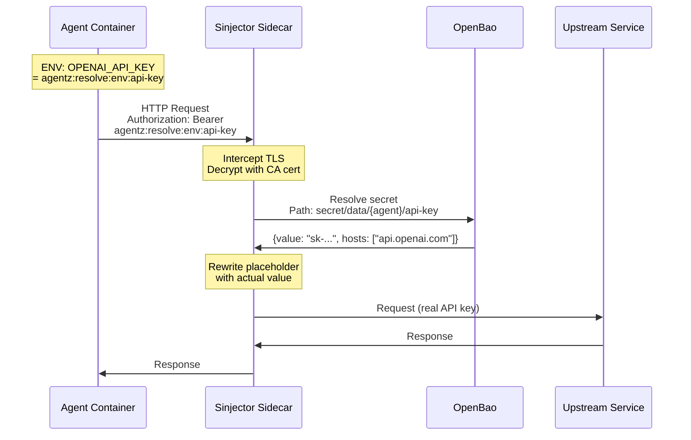

# Secret Injection

AgentZ implements a zero-trust secret management model where agent
containers never receive secret values directly. Instead, a per-agent proxy
(sinjector) intercepts outbound requests, resolves secret references from
OpenBao, and injects the actual values before forwarding traffic to upstream
services.

## Problem Statement

Traditional approaches to secret management in AI agents have a fundamental
flaw: the agent needs access to secrets (API keys, tokens, credentials) to
make authenticated requests to external services. This creates risk:

- The agent's runtime sandbox contains sensitive credentials
- If the agent is compromised, all secrets are exposed

AgentZ eliminates this attack surface by removing secrets from the agent
container entirely.

## Architecture

The secret injection system consists of three components:

The sinjector is a sidecar container running alongside the agent. It
implements an HTTP proxy with man-in-the-middle (MITM) capabilities:

1. **Certificate Management**: The proxy presents a dynamically-generated TLS
   certificate signed by a CA that AgentZ manages. The agent trusts this CA
   implicitly because the CA bundle is mounted into the agent's trust store.
2. **Request Interception**: The agent container is configured to use the
   sinjector as its HTTP/HTTPS proxy. All outbound traffic flows through the
   proxy.
3. **Placeholder Rewriting**: The proxy scans request headers, query
   parameters, and URL paths for secret placeholders in the format
   `agentz:resolve:env:{secret-name}`.
4. **Secret Resolution**: When a placeholder is found, the proxy fetches the
   corresponding secret from OpenBao using the agent's Kubernetes service
   account identity.
5. **Host Validation**: Each secret in OpenBao includes a `hosts` field that
   specifies which destinations can receive that secret. If the request target
   is not in the allowed list, the placeholder is left unresolved (the request
   fails).
6. **Request Forwarding**: After rewriting, the proxy establishes a new TLS
   connection to the upstream service using its own certificate, and forwards
   the modified request.
